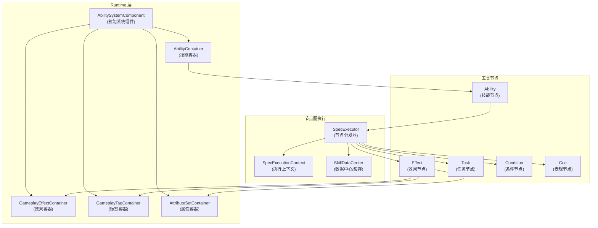
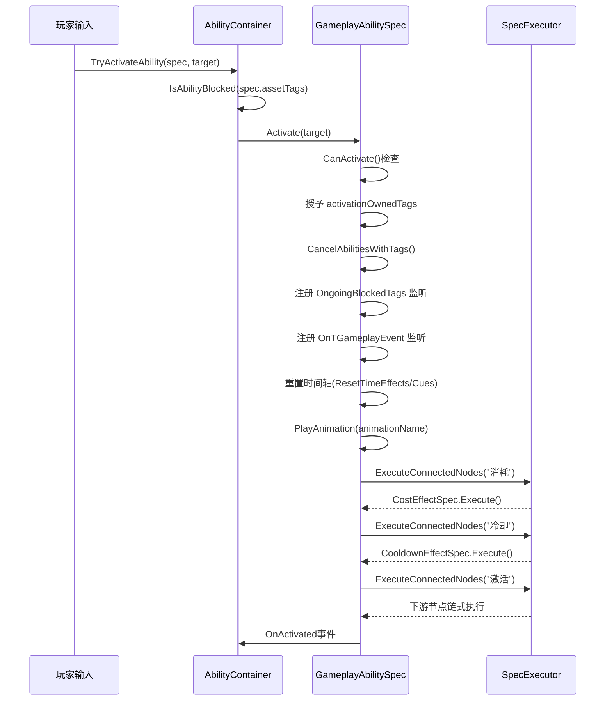
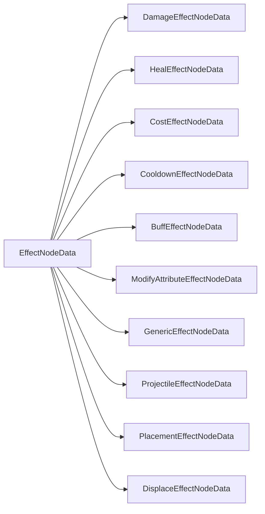
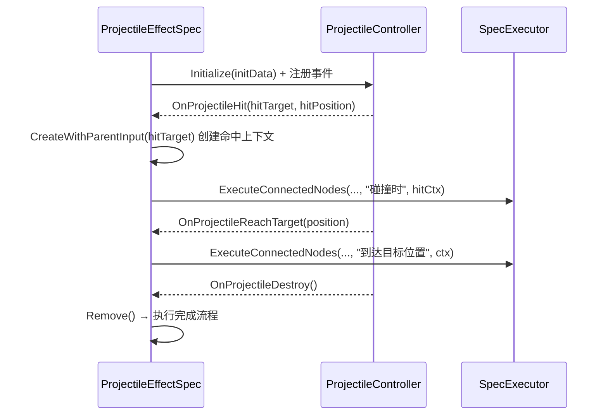
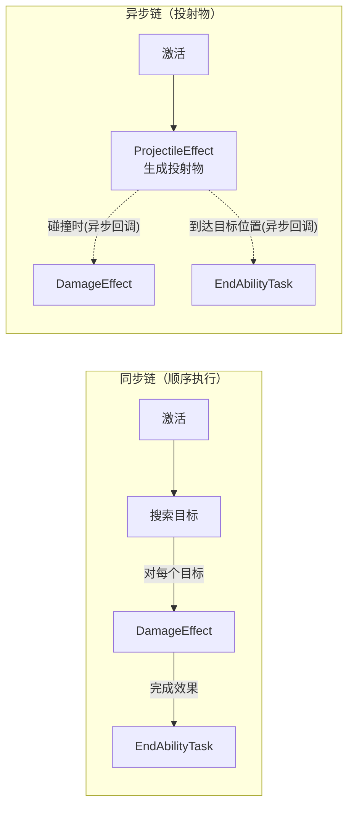
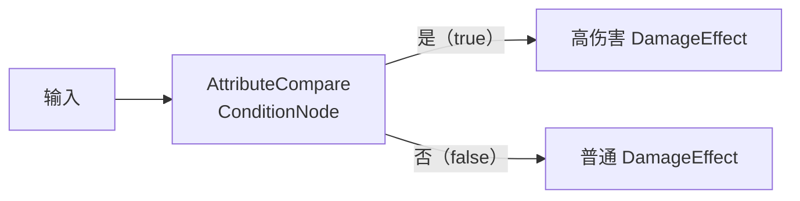
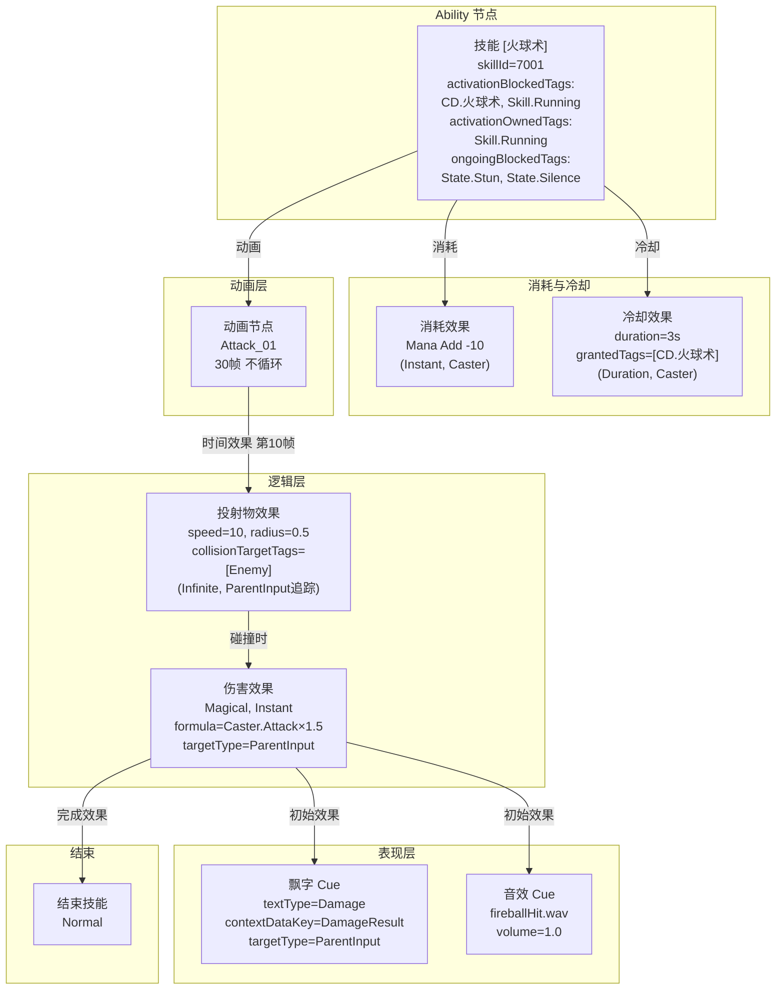

# XHFrameworkSkill 技能编辑器学习手册

> 本手册基于 XHFrameworkSkill 项目真实代码（Unity 2022.3.62f2c1）编写，所有原理、字段、流程均有源码对应，可直接对照阅读与扩展。

---

## 目录

- [第 0 章：项目全景与核心概念](#第-0-章项目全景与核心概念)
- [第 1 章：技能节点（Ability Node）](#第-1-章技能节点ability-node)
- [第 2 章：效果节点（Effect Node）](#第-2-章效果节点effect-node)
- [第 3 章：任务节点（Task Node）](#第-3-章任务节点task-node)
- [第 4 章：条件节点（Condition Node）](#第-4-章条件节点condition-node)
- [第 5 章：表现节点（Cue Node）](#第-5-章表现节点cue-node)
- [第 6 章：火球术完整配置手册](#第-6-章火球术完整配置手册)
- [第 7 章：常见问题排查与扩展指南](#第-7-章常见问题排查与扩展指南)
- [第 8 章：核心子系统深度剖析](#第-8-章核心子系统深度剖析)
- [第 9 章：高级主题与实战模式](#第-9-章高级主题与实战模式)
- [第 10 章：SpecExecutor 分发机制与 Effect 状态机](#第-10-章specexecutor-分发机制与-effect-状态机)
- [第 11 章：编辑器架构深度剖析](#第-11-章编辑器架构深度剖析)
- [第 12 章：新增节点类型全链路指南](#第-12-章新增节点类型全链路指南)

---

## 第 0 章：项目全景与核心概念

### 0.1 整体架构

XHFrameworkSkill 的核心设计思想来自虚幻引擎 GAS（Gameplay Ability System），用 Unity 实现了一套「一体化」的节点图技能编辑器：配置一个技能只有一张图，所有效果、投射物、Buff、表现都在同一张图中可视化呈现。



### 0.2 三层目录职责

| 层 | 路径 | 职责 |
|---|---|---|
| **Data 层** | `Assets/SkillEditor/Data/` | 纯数据定义（`[Serializable]`），被 Unity 序列化为 `.asset`，编辑器与运行时共享 |
| **Editor 层** | `Assets/SkillEditor/Editor/` | 编辑器 UI（继承 `GraphView`、`Node`），只在 Editor 模式运行，**不打包** |
| **Runtime 层** | `Assets/SkillEditor/Runtime/` | 运行时执行逻辑（Spec 类），处理激活、效果、Tick、Cue 播放等 |

**数据流向**：Editor 层写 Data → Data 保存为 `.asset` → Runtime 从 `SkillDataCenter` 读 Data → Spec 执行逻辑。

### 0.3 SkillGraphData：技能图的序列化结构

```csharp
// Assets/SkillEditor/Data/Base/SkillGraphData.cs
[CreateAssetMenu(fileName = "SkillGraph", menuName = "SkillEditor/SkillGraph")]
public class SkillGraphData : ScriptableObject
{
    public List<NodeData> nodes;           // 所有节点数据
    public List<ConnectionData> connections; // 所有连线数据
}

// 连线数据：记录「哪个节点的哪个端口」→「哪个节点的哪个端口」
[Serializable]
public class ConnectionData
{
    public string outputNodeGuid;   // 起点节点 Guid
    public string outputPortName;   // 起点端口名（如 "激活"、"碰撞时"）
    public string inputNodeGuid;    // 终点节点 Guid
    public string inputPortName;    // 终点端口名（通常是 "输入"）
}
```

> **重要**：`outputPortName` 是连接查询的关键。`SpecExecutor.ExecuteConnectedNodes(skillId, nodeGuid, "碰撞时", context)` 的第三个参数就是这个字符串，必须与节点编辑器中创建端口时的 `portName` 完全一致。

### 0.4 SkillDataCenter：三级缓存

`SkillDataCenter`（单例）在技能注册时一次性建立三张缓存字典，运行时所有查询都走缓存，无需遍历原始数据。

```
SkillDataCenter
├── _skillGraphs          Dictionary<skillId, SkillGraphData>
│   └── key: SkillGraphData.name（ScriptableObject 资源名）
├── _nodeCache            Dictionary<"skillId:nodeGuid", NodeData>
│   └── O(1) 按 Guid 查节点
├── _connectionCache      Dictionary<"skillId:nodeGuid:portName", List<ConnectionData>>
│   └── O(1) 查「某节点某端口」的所有下游连线
└── _abilityNodeCache     Dictionary<skillId, AbilityNodeData>
    └── 快速获取 Ability 根节点
```

**注册时机**：`GameplayAbilitySpec` 构造时调用 `SkillDataCenter.Instance.RegisterSkillGraph(graphData)`，首次注册才建缓存（已注册则跳过）。

### 0.4.1 GASHost：全局 Tick 驱动器

`GASHost` 是一个挂载在 `DontDestroyOnLoad` 的 `MonoBehaviour` 单例，负责集中驱动所有 ASC 的帧更新，避免每个单位各自挂载 MonoBehaviour 造成调度开销。

```
GASHost.Update() 每帧执行：
├── foreach ASC in _registeredASCs:
│   └── ASC.Tick(deltaTime * TimeScale)
│       ├── AbilityContainer.Tick() → 每个激活技能的 Tick
│       │   └── GameplayAbilitySpec.Tick() → CheckTimeEffectTriggers + CheckTimeCueTriggers + UpdateRunningEffects
│       └── EffectContainer.Tick() → 每个 Duration/Infinite Effect 的 Tick
│           └── GameplayEffectSpec.Tick() → 周期计时 + 超时检查 → Expire
├── GameplayCueManager.Instance.Tick() → 管理所有活跃 Cue 的生命周期
└── 处理待添加/待移除的 ASC（避免遍历时修改集合）
```

关键字段：
- `TimeScale`：时间缩放（默认 1.0），可用于全局慢动作或暂停
- `IsPaused`：暂停标志，为 true 时跳过所有 Update

ASC 注册/注销采用延迟列表模式（`_pendingAdd` / `_pendingRemove`），确保遍历安全。

### 0.4.2 SpecFactory：节点类型到 Spec 的映射

`SpecFactory` 是一个静态工厂类，`SpecExecutor` 在分发节点时通过它创建对应的 Spec 实例：

| 工厂方法 | 创建的 Spec 类型 | 注册的 NodeType |
|---|---|---|
| `CreateEffectSpec(nodeType)` | `GameplayEffectSpec` 子类 | DamageEffect, HealEffect, CostEffect, ModifyAttributeEffect, GenericEffect, ProjectileEffect, PlacementEffect, DisplaceEffect, CooldownEffect, BuffEffect |
| `CreateTaskSpec(nodeType)` | `TaskSpec` 子类 | SearchTargetTask, EndAbilityTask |
| `CreateConditionSpec(nodeType)` | `ConditionSpec` 子类 | AttributeCompareCondition |
| `CreateCueSpec(nodeType)` | `GameplayCueSpec` 子类 | ParticleCue, SoundCue, FloatingTextCue |

> **扩展要点**：新增节点类型时，必须在对应的 `Create*Spec` 方法中添加 `case`，否则 `SpecExecutor` 会拿到 null 而静默跳过该节点。

### 0.5 SpecExecutionContext：执行上下文全字段

上下文是整个节点执行链的「信使」，贯穿所有 Spec。

| 字段 | 类型 | 说明 |
|------|------|------|
| `AbilitySpec` | `GameplayAbilitySpec` | 当前执行的技能实例，可调用 `End()` 结束技能 |
| `OwnerEffectSpec` | `GameplayEffectSpec` | 触发当前节点的 Effect（如 Buff），Cue 用此字段注册生命周期 |
| `Caster` | `AbilitySystemComponent` | 施法者 ASC |
| `MainTarget` | `AbilitySystemComponent` | 技能主目标 ASC（激活时指定） |
| `ParentInputTarget` | `AbilitySystemComponent` | 父节点传入的目标（搜索/投射物命中时设置） |
| `Targets` | `List<ASC>` | 当前目标列表 |
| `ProjectileObject` | `GameObject` | 飞行中的投射物对象（ProjectileEffectSpec 设置） |
| `PlacementObject` | `GameObject` | 放置物对象（PlacementEffectSpec 设置） |
| `AbilityLevel` | `int` | 技能等级，默认 1 |
| `StackCount` | `int` | 触发此上下文的 Effect 的堆叠层数（BuffEffectSpec 传入） |
| `CustomData` | `Dictionary<string, object>` | 自定义数据，如 `"DamageResult"`、`"HitPosition"` |

**关键方法**：

```csharp
// 根据 TargetType 枚举获取目标（每个节点的 targetType 字段使用此方法）
public AbilitySystemComponent GetTarget(TargetType targetType)
// Caster → 施法者  MainTarget → 主目标  ParentInput → 父节点传入

// 为每个搜索目标/命中目标创建独立副本（不影响父上下文）
public SpecExecutionContext CreateWithParentInput(AbilitySystemComponent target)

// 按挂点名称获取世界坐标（支持 Spine 骨骼绑定点）
public Vector3 GetPosition(PositionSourceType sourceType, string bindingName = null)
```

### 0.6 SpecExecutor：节点分发路由

`SpecExecutor` 是静态工具类，负责「根据端口名找下游节点 → 按类型分发执行」。

```csharp
// 核心入口
public static void ExecuteConnectedNodes(
    string skillId,       // 技能 ID（SkillGraphData.name）
    string nodeGuid,      // 当前节点 Guid
    string outputPortName,// 输出端口名（如 "激活"、"碰撞时"、"完成效果"）
    SpecExecutionContext context)
```

**内部分发逻辑**（按 `NodeCategory` 枚举）：

| NodeCategory | 对应 NodeType | 执行方式 |
|---|---|---|
| `Effect` | DamageEffect, HealEffect, BuffEffect, ProjectileEffect 等 | `SpecFactory.CreateEffectSpec()` → `Initialize()` → `Execute()` |
| `Task` | SearchTargetTask, EndAbilityTask, Animation | `SpecFactory.CreateTaskSpec()` → `Initialize()` → `Execute()` |
| `Condition` | AttributeCompareCondition | `SpecFactory.CreateConditionSpec()` → `Initialize()` → `Execute()` |
| `Cue` | ParticleCue, SoundCue, FloatingTextCue | `SpecFactory.CreateCueSpec()` → `Initialize()` → `Execute()` |

> **动画节点（Animation）的 NodeCategory 是 Task**，但它不走普通的 TaskSpec，而是由 `GameplayAbilitySpec` 在构造时直接从「动画」端口读取连接的 `AnimationNodeData`，驱动时间轴。

---

## 第 1 章：技能节点（Ability Node）

> 核心文件：
> - `Assets/SkillEditor/Data/Ability/AbilityNodeData.cs`
> - `Assets/SkillEditor/Runtime/Ability/GameplayAbilitySpec.cs`
> - `Assets/SkillEditor/Editor/Ability/AbilityNode.cs`
> - `Assets/SkillEditor/Runtime/Ability/AbilityContainer.cs`

### 1.1 Ability Node 是整张图的根节点

技能节点（`NodeType.Ability`）是每张 `SkillGraphData` 中**有且只有一个**的根节点，没有输入端口（`HasDefaultInputPort = false`）。它本身不执行任何游戏逻辑，只承担两件事：

1. **配置技能的「身份」与「许可条件」**（七组标签 + 消耗/冷却节点连线）
2. **作为执行链的起点**，通过输出端口触发后续节点

### 1.2 七组标签字段详解

`AbilityNodeData` 中有七组 `GameplayTagSet` 类型的标签字段，含义各不相同：

| 字段名 | 中文名 | 作用时机 | 具体行为 |
|--------|--------|----------|----------|
| `assetTags` | 技能自身标签 | 随时 | 标识本技能的身份，被 `IsAbilityBlocked`、`CancelAbilitiesWithTags` 等方法检查 |
| `activationRequiredTags` | 激活所需标签 | `CanActivate()` 时 | 拥有者**必须拥有全部标签**才能激活，任意缺失则拒绝 |
| `activationBlockedTags` | 激活阻止标签 | `CanActivate()` 时 | 拥有者**拥有任意一个**则拒绝激活（CD 标签、Skill.Running 标签常用于此） |
| `activationOwnedTags` | 激活授予标签 | `Activate()` 时 | 激活成功后立即授予拥有者，`End()` 时移除（可用于「技能进行中」状态标识） |
| `cancelAbilitiesWithTags` | 激活时取消标签 | `Activate()` 时 | 激活时取消拥有者身上所有 `assetTags` 包含这些标签的技能 |
| `blockAbilitiesWithTags` | 阻止其他技能标签 | 运行期间 | 本技能激活时，阻止其他 `assetTags` 包含这些标签的技能激活（`IsAbilityBlocked` 检查） |
| `ongoingBlockedTags` | 运行中打断标签 | 运行期间（实时监听） | 运行中若拥有者**获得**任意一个这些标签，技能立即被取消（用于眩晕/沉默打断） |

**示例（火球术配置）**：

```
assetTags            = [Skill.火球术]
activationBlockedTags = [CD.火球术, Skill.Running]
activationOwnedTags  = [Skill.Running]
ongoingBlockedTags   = [State.Stun, State.Silence]
```

### 1.3 CanActivate() 完整校验流程

```csharp
// GameplayAbilitySpec.cs
public bool CanActivate()
{
    // 1. 状态检查：已激活则拒绝（不允许同技能重入）
    if (State == AbilityState.Active) return false;
    if (Owner == null) return false;

    // 2. 激活所需标签：拥有者必须拥有全部标签
    if (!Tags.ActivationRequiredTags.IsEmpty)
        if (!Owner.HasAllTags(Tags.ActivationRequiredTags)) return false;

    // 3. 激活阻止标签：拥有者拥有任意一个则拒绝
    if (!Tags.ActivationBlockedTags.IsEmpty)
        if (Owner.HasAnyTags(Tags.ActivationBlockedTags)) return false;

    // 4. 消耗检查：遍历 CostEffect 的 attributeModifiers，验证属性值是否足够
    if (!CanAffordCost()) return false;

    return true;
}
```

> **冷却检查不在 `CanActivate()` 里**：冷却通过 `activationBlockedTags` 实现，CooldownEffect 应用时授予 `CD.xxx` 标签，到期时移除，从而自然地被 `activationBlockedTags` 拦截。

### 1.4 激活完整时序



### 1.5 五个输出端口与执行调用位置

| 端口名 | 端口方向 | 执行调用位置（GameplayAbilitySpec.cs） | 执行时机 |
|--------|----------|----------------------------------------|----------|
| `"消耗"` | inputContainer（左侧） | `Activate()` 中 `ExecuteConnectedNodes(..., "消耗", ...)` | 激活时立即，扣除资源 |
| `"冷却"` | inputContainer（左侧） | `Activate()` 中 `ExecuteConnectedNodes(..., "冷却", ...)` | 激活时立即，应用 CD Effect |
| `"激活"` | outputContainer（右侧） | `Activate()` 中 `ExecuteConnectedNodes(..., "激活", ...)` | 激活后，主逻辑链起点 |
| `"动画"` | outputContainer（右侧） | **构造时** `FindAnimationNode()` 从此端口读取 AnimationNodeData | 不走 SpecExecutor，由 Tick 驱动时间轴 |
| 事件端口（如 `"受击时"`） | outputContainer（右侧） | `OnGameplayEvent()` 中按 PortId 匹配执行 | 对应 `GameplayEventType` 触发时 |

> **「动画」端口的特殊性**：它在 Ability 节点 `Activate()` 时**不走** `SpecExecutor.ExecuteConnectedNodes`，而是在构造时（`FindAnimationNode()`）从该端口的连线中读取 `AnimationNodeData`，把帧数据转成秒存入 `_timeEffects` / `_timeCues` 列表，由每帧 `Tick()` 驱动。

### 1.6 事件端口机制（被动技能与事件响应）

在 `AbilityNode` 编辑器 UI 中，可以点击「+」按钮添加**事件监听端口**，每个端口对应一个 `AbilityEventPortData`：

```csharp
public class AbilityEventPortData
{
    public GameplayEventType eventType;  // OnHit / OnDealDamage / OnTakeDamage / OnDeath / OnKill / Custom
    public string PortId;                // 运行时端口标识（等于端口名字符串，如 "受击时"）
    public string customEventTag;        // eventType = Custom 时使用
}
```

**触发路径**：

```
AbilitySystemComponent.OnTGameplayEvent 事件触发（如受到伤害时）
    ↓ Attributes.OnAnyAttributeChanged → Health 减少 → 触发 OnTakeDamage
    ↓
GameplayAbilitySpec.OnGameplayEvent(GameplayEventType type)
    ↓ 遍历 AbilityNodeData.eventOutputPorts，找到 eventType 匹配的端口
    ↓
SpecExecutor.ExecuteConnectedNodes(SkillId, _abilityNodeGuid, portData.PortId, _context)
    ↓
执行该事件端口连接的下游节点
```

> **被动技能实现方式**：被动技能无需主动激活，只需在 `activationRequiredTags` / `activationBlockedTags` 设为空（随时可激活），然后通过事件端口响应游戏事件执行效果。也可以在 Ability 激活时（`Activate()` → `"激活"` 链）挂一个 Buff，Buff 的「每周期执行」或「事件端口」负责周期触发。

### 1.7 ongoingBlockedTags 运行中打断原理

```csharp
// Activate() 时注册监听
private void RegisterTagListener()
{
    if (!Tags.OngoingBlockedTags.IsEmpty)
        Owner.OwnedTags.OnTagAdded += OnOwnerTagAdded;
}

// 每当拥有者获得新标签时触发
private void OnOwnerTagAdded(GameplayTag tag)
{
    if (Tags.OngoingBlockedTags.HasTag(tag))
        Cancel(); // 立即取消技能
}
```

这意味着：若你对施法者应用一个 `grantedTags = [State.Stun]` 的 Effect，且技能的 `ongoingBlockedTags` 包含 `State.Stun`，技能会在该 Effect 应用的瞬间被取消。

### 1.8 End() 流程：技能结束时发生什么

```
End(wasCancelled)
├── 取消 OngoingBlockedTags 监听（UnregisterTagListener）
├── 取消 OnTGameplayEvent 监听
├── 设置 State = Ended / Cancelled
├── 停止动画（播放 "Stand" 循环动画）
├── 停止所有时间 Cue（StopAllTimeCues → 调用每个 Cue 的 Stop()）
├── 遍历 _runningEffects：
│   ├── 只移除 cancelOnAbilityEnd = true 的 Effect
│   └── CD、Buff（cancelOnAbilityEnd = false）不被移除，继续存在
├── 移除 activationOwnedTags（如 Skill.Running）
└── 触发 OnEnded 事件
```

### 1.9 AbilityContainer 完整工作流

`AbilityContainer` 是 ASC 上管理所有技能实例的容器，理解它的工作方式对调试技能问题至关重要：

```
AbilityContainer
├── GrantAbility(graphData)           → 创建 GameplayAbilitySpec 实例，注册技能图到 SkillDataCenter
│   └── 返回 spec，可保存引用后续激活
├── TryActivateAbility(spec, target)  → 先检查 IsAbilityBlocked(spec) → 再调用 spec.Activate(target)
│   ├── IsAbilityBlocked 检查：遍历所有已激活技能的 blockAbilitiesWithTags
│   │   是否包含待激活技能的 assetTags → 有则阻止
│   └── Activate 成功后加入 _activeAbilities 列表
├── CancelAbility(spec)               → 调用 spec.Cancel()，从 _activeAbilities 移除
├── EndAbility(spec)                  → 调用 spec.End()，从 _activeAbilities 移除
├── CancelAbilitiesWithTags(tags)     → 遍历 _activeAbilities，取消所有 assetTags 含指定标签的技能
├── Tick(deltaTime)                   → 遍历 _activeAbilities 调用每个 spec 的 Tick
│   └── 技能 Tick 期间可能触发 End()，同样使用 pendingRemove 避免遍历修改
└── RemoveAbility(spec)               → 从 _grantedAbilities 完全移除，技能不可再激活
```

**IsAbilityBlocked 机制详解**：

当技能 A 正在运行且配置了 `blockAbilitiesWithTags = [Skill.基础攻击]`，此时尝试激活基础攻击（`assetTags = [Skill.基础攻击]`）：
1. `TryActivateAbility` → `IsAbilityBlocked(基础攻击spec)` 
2. 遍历 `_activeAbilities`，发现技能 A 的 `blockAbilitiesWithTags` 包含 `Skill.基础攻击`
3. 返回 `true`，激活被阻止

这是一个**运行时动态阻止机制**，与 `activationBlockedTags` 不同：后者检查的是拥有者身上的标签，前者检查的是其他正在运行的技能的配置。

### 1.10 Activate 内部完整执行顺序（含边界情况）

```csharp
internal bool Activate(AbilitySystemComponent target = null)
{
    // 1. CanActivate 四步检查（已详述于 1.3 节）
    if (!CanActivate()) return false;

    // 2. 设置运行时状态
    State = AbilityState.Active;
    _mainTarget = target;

    // 3. 授予 activationOwnedTags（如 Skill.Running）
    //    此操作可能触发其他技能的 ongoingBlockedTags 监听而取消其他技能
    Owner.OwnedTags.AddTags(Tags.ActivationOwnedTags);

    // 4. CancelAbilitiesWithTags：取消带有指定标签的其他技能
    //    注意：先授予标签再取消，保证此时 Skill.Running 已存在
    Owner.AbilityContainer.CancelAbilitiesWithTags(Tags.CancelAbilitiesWithTags);

    // 5. 注册 ongoingBlockedTags 标签监听
    RegisterTagListener();

    // 6. 注册 GameplayEvent 事件监听（被动技能事件端口）
    RegisterEventListener();

    // 7. 读取动画节点数据并重置时间轴
    ResetTimeEffects();
    ResetTimeCues();

    // 8. 播放动画（从 AnimationNodeData 获取动画名和帧数）
    PlayAnimation();

    // 9. 按端口名依次执行连线节点
    SpecExecutor.ExecuteConnectedNodes(SkillId, _abilityNodeGuid, "消耗", _context);
    SpecExecutor.ExecuteConnectedNodes(SkillId, _abilityNodeGuid, "冷却", _context);
    SpecExecutor.ExecuteConnectedNodes(SkillId, _abilityNodeGuid, "激活", _context);

    // 10. 触发 OnActivated 回调
    return true;
}
```

> **关键顺序**：消耗 → 冷却 → 激活。这意味着 `CanActivate()` 通过后，MP 先扣除、CD 先应用，然后才执行主逻辑链。如果主逻辑链中出错或被打断，消耗和冷却**不会回退**——这是 GAS 的标准行为。

---

## 第 2 章：效果节点（Effect Node）

> 核心文件：
> - `Assets/SkillEditor/Data/Base/EffectNodeData.cs`
> - `Assets/SkillEditor/Runtime/Effect/GameplayEffectSpec.cs`
> - 各子类 Data/Spec 文件

### 2.1 效果节点总览

效果节点对应 GAS 的 `GameplayEffect`，是技能系统中**修改游戏状态**的唯一途径（属性增减、标签授予、堆叠管理）。所有 Effect 节点都继承 `EffectNodeData`，运行时对应 `GameplayEffectSpec` 的各个子类。



### 2.2 三种持续类型对比

| 特性 | Instant（瞬时） | Duration（持续） | Infinite（永久） |
|------|----------------|-----------------|-----------------|
| **典型用途** | 伤害、治疗、消耗 | 冷却、Buff、中毒 | 投射物飞行期间、永久被动 |
| **加入 EffectContainer** | 否 | 是 | 是 |
| **授予 grantedTags** | 否 | 是（持续期间）| 是（直到移除） |
| **属性修改方式** | 直接改 `BaseValue`（永久） | 添加 `Modifier`（临时，移除时回退） | 添加 `Modifier`（临时，移除时回退） |
| **执行 Tick** | 否 | 是（计时/周期） | 是（周期） |
| **结束条件** | 立即结束 | 超时（ElapsedTime ≥ Duration） | 显式调用 `Remove()` |
| **走完成流程** | 是（Apply 后立即） | 是（到期或 Remove 时） | 是（Remove 时） |

### 2.3 三大执行流程（代码层面）

`GameplayEffectSpec` 内部有三个私有方法，在不同时机调用：

```
ExecuteInitialFlow(target)
├── 瞬时 Effect：直接修改属性 BaseValue
│   └── foreach modifier → attribute.BaseValue += magnitude
├── SpecExecutor.ExecuteConnectedNodes(..., "初始效果", ctx)
│   └── 触发所有连在「初始效果」端口的下游节点（如飘字 Cue）
└── OnInitialHook(target)  // 子类可重写（如 ProjectileEffectSpec）

ExecutePeriodicFlow()
├── SpecExecutor.ExecuteConnectedNodes(..., "每周期执行", ctx)
└── OnPeriodicHook()

ExecuteCompleteFlow()
├── SpecExecutor.ExecuteConnectedNodes(..., "完成效果", ctx)
└── OnCompleteHook()
```

**调用时机矩阵**：

| 调用场景 | InitialFlow | PeriodicFlow | CompleteFlow |
|----------|-------------|--------------|--------------|
| Instant Effect Apply | ✓ | — | ✓ |
| Duration/Infinite 首次 Apply | ✓ | ✓（若 executeOnApplication） | — |
| Tick 周期到 | — | ✓ | — |
| Duration 到期（Expire） | — | — | ✓ |
| Remove() 调用 | — | — | ✓ |
| 堆叠刷新（Refresh） | — | — | — |

### 2.4 AttributeModifierData：属性修改器六字段全解

每个 Effect 节点可配置多个 `AttributeModifierData`，每条记录独立修改一种属性：

| 字段 | 类型 | 说明 |
|------|------|------|
| `attrType` | `AttrType` 枚举 | 目标属性（Health, Mana, Attack, Defense, MaxHealth 等） |
| `operation` | `ModifierOperation` | Add（加法）/ Multiply（乘法）/ Divide（除法）/ Override（覆盖） |
| `magnitudeSourceType` | `ModifierMagnitudeSourceType` | 数值来源类型（见下表） |
| `fixedValue` | `float` | 固定值（SourceType = FixedValue 时使用） |
| `formula` | `string` | 公式字符串（SourceType = Formula 时使用，如 `"Caster.Attack * 1.5"`） |
| `mmcType` / `mmcCaptureAttribute` / `mmcCoefficient` / `mmcUseSnapshot` | — | MMC 计算器配置（SourceType = ModifierMagnitudeCalculation 时） |

**数值来源类型**：

| `ModifierMagnitudeSourceType` | 含义 | 典型用法 |
|---|---|---|
| `FixedValue` | 直接使用 `fixedValue` | 固定伤害 10 点 |
| `Formula` | 解析 `formula` 字符串，支持 `Caster.Attack`、`Target.Defense`、`Level`、`StackCount` 等变量 | `"Caster.Attack * 1.5 - Target.Defense"` |
| `ModifierMagnitudeCalculation` | 使用 MMC 计算类（AttributeBased / LevelBased） | 基于属性的复杂公式 |
| `SetByCaller` | 从 `Context.SetByCallerValues[key]` 读取，由调用方在运行时注入 | 外部传入的动态值 |

> **MMC 快照（`mmcUseSnapshot = true`）**：施放时捕获施法者属性值存入 `SnapshotValues`，后续计算用快照值而非实时值，防止施法者属性变化影响已飞行中的投射物伤害。

### 2.5 持续 Effect 的属性修改机制

- **Duration/Infinite 应用时**：`Execute()` 把 `Modifier` 对象加到目标 `Attribute` 上，调用 `attribute.AddModifier(modifier, effectSpec)` 并 `Recalculate()`，使当前值（CurrentValue）即时更新。
- **Duration/Infinite 移除时**：`Remove()` 调用 `attribute.RemoveModifiersFromSource(this)` 把所有来源为此 Effect 的 Modifier 从 Attribute 移除，再 `Recalculate()`，属性自动恢复。
- **瞬时 Effect 应用时**：直接修改 `attribute.BaseValue`，这是**永久修改**，没有 Modifier，也不会在技能结束后回退。

### 2.6 堆叠系统五个策略字段

`EffectNodeData` 的堆叠配置（仅 Duration/Infinite 有效）：

| 字段 | 枚举值 | 说明 |
|------|--------|------|
| `stackType` | None / AggregateByTarget / AggregateBySource | None=不堆叠，AggregateByTarget=同一目标共享堆叠，AggregateBySource=每个施法者独立堆叠 |
| `stackLimit` | int（0=无限） | 最大堆叠层数，超过时触发溢出策略 |
| `stackDurationRefreshPolicy` | RefreshOnSuccessfulApplication / NeverRefresh | 堆叠时是否重置持续时间 |
| `stackPeriodResetPolicy` | ResetOnSuccessfulApplication / NeverReset | 堆叠时是否重置周期计时器 |
| `stackExpirationPolicy` | ClearEntireStack / RemoveSingleStackAndRefreshDuration / RefreshDuration | 到期时如何处理堆叠 |
| `stackOverflowPolicy` | DenyApplication / AllowOverflowEffect | 达到上限时：拒绝/触发「溢出」端口 |

**溢出端口**：当 `stackOverflowPolicy = AllowOverflowEffect` 时，`GameplayEffectSpec.Execute()` 会调用 `SpecExecutor.ExecuteConnectedNodes(..., "溢出", ctx)`，可连接额外效果。

### 2.7 ongoingRequiredTags：持续 Effect 的动态移除

```csharp
// Effect 应用时注册标签监听
private void RegisterTagListener()
{
    if (!Tags.OngoingRequiredTags.IsEmpty)
        Target.OwnedTags.OnTagAdded += OnOwnerTagAdded;  // 注意：这里逻辑反向，是监听添加
}

// 实际是监听「不再拥有」→ 用于移除
// 当目标失去 ongoingRequiredTags 中的标签时，Effect 自动移除
```

> **典型应用**：「被动回血」Buff 的 `ongoingRequiredTags` 设为 `[State.Healthy]`，若目标失去该标签（如进入战斗状态时移除），Buff 自动停止。

### 2.8 cancelOnAbilityEnd：决定 Effect 生命周期归属

```csharp
// EffectNodeData 字段
public bool cancelOnAbilityEnd = false;
```

| `cancelOnAbilityEnd` | 说明 | 典型节点 |
|---|---|---|
| `false`（默认） | Effect 由 ASC 的 `EffectContainer` 独立管理，技能结束不影响 | CooldownEffect, BuffEffect（CD 不会因技能结束消失） |
| `true` | Effect 注册到 `GameplayAbilitySpec._runningEffects`，技能结束时一并移除 | 需要与技能绑定生命周期的持续效果 |

### 2.9 GameplayEffectContainer 深度解析

`GameplayEffectContainer` 是 ASC 上管理所有**持续/永久效果**的容器（Instant 效果不进入容器）。理解它的内部机制对调试堆叠、周期效果、生命周期问题至关重要：

```
GameplayEffectContainer
├── _activeEffects     List<GameplayEffectSpec>  → 当前所有激活的持续/永久效果
├── _pendingRemove     List<GameplayEffectSpec>  → Tick 过程中标记的待移除效果
└── _isUpdating        bool                      → 遍历安全锁
```

#### 延迟移除机制

```csharp
public void Tick(float deltaTime)
{
    _isUpdating = true;
    for (int i = 0; i < _activeEffects.Count; i++)
    {
        _activeEffects[i].Tick(deltaTime);
        if (_activeEffects[i].IsExpired)
            _pendingRemove.Add(_activeEffects[i]);
    }
    _isUpdating = false;

    foreach (var effect in _pendingRemove)
        RemoveEffectInternal(effect);  // 调用 effect.Remove() 再从列表移除
    _pendingRemove.Clear();
}
```

**为什么需要延迟移除？** Effect 的 `Tick()` 可能触发周期效果（`ExecutePeriodicFlow`），周期效果的下游节点可能又调用 `RemoveEffect`（如周期伤害导致目标死亡，死亡逻辑清除所有效果）。如果在遍历时直接修改 `_activeEffects`，会导致索引错乱。

#### 堆叠查找逻辑

`FindStackableEffect(spec)` 在容器中寻找可堆叠的目标：

```
1. stackType == None → 返回 null（不堆叠，创建新 Effect）
2. 遍历 _activeEffects，匹配条件：
   a. nodeType 相同（同一种效果节点类型）
   b. assetTags 完全一致（标签相同标识同一个 Buff）
   c. AggregateByTarget → 直接返回（同一目标上的同类效果共享堆叠）
   d. AggregateBySource → 还需 Source 一致（同一施法者的同类效果才堆叠）
3. 未找到 → 返回 null，创建新 Effect 实例
```

> **AggregateByTarget vs AggregateBySource**：中毒效果用 AggregateByTarget（不管谁施加的，同一目标上的毒都叠加），而个人 Buff 用 AggregateBySource（A 给的增益和 B 给的增益独立存在）。

#### 按标签/来源移除效果

```csharp
RemoveEffectsWithTags(tags)    // 移除 assetTags 含指定标签的所有效果
RemoveEffectsFromSource(source) // 移除来自指定施法者的所有效果
```

这两个方法常用于：
- **驱散**：移除目标身上所有带 `Debuff` 标签的效果 → `RemoveEffectsWithTags([Debuff])`
- **死亡清理**：移除来自死亡单位的所有效果 → `RemoveEffectsFromSource(deadASC)`
- **Effect 的 removeGameEffectsWithTags**：Effect 应用时主动清除目标身上的旧效果（如新 Buff 覆盖旧 Buff）

#### 效果查询 API

| 方法 | 返回 | 典型用法 |
|---|---|---|
| `FindEffectByTag(tag)` | 第一个匹配的 Effect | 检查目标是否被某 Debuff 影响 |
| `FindEffectByGrantedTag(tag)` | 授予该标签的 Effect | 查找冷却效果（按 `CD.xxx` 标签查找） |
| `FindBuffById(buffId)` | 指定 ID 的 BuffEffectSpec | 按 Buff ID 查询堆叠状态 |
| `GetEffectCountByType(nodeType)` | int | 统计目标身上某类效果数量 |
| `HasEffectWithTag(tag)` | bool | 快速判断是否存在某效果 |

### 2.10 各子类特殊字段

#### DamageEffectNodeData（伤害效果）

| 字段 | 说明 |
|------|------|
| `damageType` | Physical / Magical / True（真实伤害不计算减免） |
| `damageSourceType` | 伤害数值来源（FixedValue / Formula / MMC / SetByCaller） |
| `damageFixedValue` | 固定伤害值（默认 10） |
| `damageFormula` | 伤害公式，如 `"Caster.Attack * 1.5"` |
| `damageMultiplyByStackCount` | 是否乘以堆叠层数（被 Buff 触发时，伤害 × Buff 层数） |
| `damageCalculationType` | 伤害计算类（Default，可扩展） |

**DamageEffectSpec 伤害计算全流程**：

```
DamageEffectSpec.OnInitialHook(target)
│
├── 1. CalculateDamage(nodeData, target) → 根据 damageSourceType 选择计算方式：
│   ├── FixedValue  → 直接使用 damageFixedValue
│   ├── Formula     → FormulaEvaluator.Evaluate(formula, { Caster.*, Target.*, Level, StackCount })
│   ├── SetByCaller → 从 Context.SetByCallerValues[key] 读取
│   └── MMC         → AttributeBased: 属性值 × 系数 / LevelBased: 固定值 × (1 + Level × 0.1)
│
├── 2. 堆叠层数乘算（damageMultiplyByStackCount = true 时）
│   └── baseDamage *= Context.StackCount（Buff 触发时自动传入层数）
│
├── 3. 护甲减伤计算（damageCalculationType = Default && damageType ≠ True 时）
│   ├── Physical → 读取 target.Defense
│   ├── Magical  → 读取 target.MagicDefense
│   └── 公式：finalDamage = baseDamage × 100 / (100 + defense)
│       └── defense=0 → 全额伤害；defense=100 → 半额伤害；defense 越高衰减越慢
│
├── 4. Clamp: baseDamage = Max(0, baseDamage)
│
├── 5. 应用伤害：target.Health.BaseValue -= baseDamage
│
└── 6. 写入 DamageResult 到 Context.CustomData["DamageResult"]
    └── 结构体 DamageResult(amount, isCritical, isMiss, damageType)
        └── 供下游 FloatingTextCue 读取
```

> **护甲公式 `100/(100+D)` 的含义**：这是 MOBA/ARPG 中常见的减伤曲线，保证 Defense 永远无法达到 100% 减伤。例如 Defense=100 时减伤 50%，Defense=300 时减伤 75%。真实伤害（`DamageType.True`）跳过此步。

> **MMC 快照模式**：`damageMMCUseSnapshot = true` 时，施放时捕获的施法者属性值用于后续所有伤害计算（如投射物飞行期间施法者攻击力变化不影响此次伤害）。快照值存储在 `GameplayEffectSpec.SnapshotValues` 字典中。

#### HealEffectSpec 治疗计算特殊逻辑

治疗效果与伤害效果结构对称，但有两个独特行为：

```
HealEffectSpec.OnInitialHook(target)
│
├── 1. 满血检查：Health == MaxHealth → 直接 return（不产生 0 治疗飘字）
├── 2. CalculateHeal() → 同伤害的四种来源
├── 3. 堆叠层数乘算
├── 4. Clamp: baseHeal = Max(0, baseHeal)
├── 5. 应用治疗：Health = Min(Health + heal, MaxHealth)
│   └── 修改 BaseValue，CurrentValue 自动重计算
├── 6. 写入 Context.CustomData["Heal"] = baseHeal
└── 7. ExecuteConnectedNodes("治疗") → 额外输出端口
```

注意治疗效果有一个**独有的 "治疗" 输出端口**，与基类的 "初始效果" 端口并列。这允许在治疗成功时触发特殊逻辑（如治疗量统计、治疗减半 Debuff 的检查等），而 "初始效果" 端口在所有 Effect 上都有。

#### CooldownEffectNodeData（冷却效果）

| 字段 | 说明 |
|------|------|
| `cooldownType` | Normal（普通 CD）/ Charge（充能 CD） |
| `maxCharges` | 最大充能数（充能模式，默认 2） |
| `chargeTime` | 每层充能恢复时间（公式字符串，默认 "10"） |
| `durationType`（继承） | 构造时强制 = Duration |
| `cancelOnAbilityEnd`（继承） | 构造时强制 = false（CD 不随技能结束） |
| `grantedTags`（继承） | **必须配置 CD 标签**（如 `CD.火球术`），否则 `IsOnCooldown()` 无法检测 |

**CooldownEffectSpec 普通 CD vs 充能 CD 完整对比**：

| 特性 | Normal（普通 CD） | Charge（充能 CD） |
|------|------|------|
| 激活时 | 调用 `base.Execute()`，走标准 Duration 流程 | 调用 `ExecuteChargeCooldown()`，消耗一层充能 |
| CD 标签管理 | Duration 到期自动移除 `grantedTags` | 充能数 > 0 时移除 CD 标签（可释放），= 0 时添加 CD 标签（阻止） |
| Tick 行为 | 基类 Tick（倒计时 → Expire → Remove） | 充能 Tick（倒计时 → 恢复一层 → 继续直到满） |
| 多次释放 | CD 期间不能释放 | 有充能数就能释放，全部消耗后才阻止 |
| Effect 注册 | 标准流程 AddEffect | `EnsureRegistered()` 确保只注册一次到 Container |

充能 CD 核心状态机：

```
初始状态：CurrentCharges = MaxCharges, ChargeTimer = 0
│
├── 技能释放（ExecuteChargeCooldown）：
│   ├── CurrentCharges-- (2→1)
│   ├── 首次消耗时启动充能计时器：ChargeTimer = ChargeTime
│   └── UpdateChargeCooldownTag：Charges > 0 → 移除 CD 标签（仍可释放）
│
├── 再次释放：
│   ├── CurrentCharges-- (1→0)
│   └── UpdateChargeCooldownTag：Charges == 0 → 添加 CD 标签（阻止释放）
│
├── Tick（每帧充能恢复）：
│   ├── ChargeTimer -= deltaTime
│   ├── ChargeTimer <= 0 → CurrentCharges++
│   ├── 还没满 → ChargeTimer = ChargeTime（继续充能）
│   └── UpdateChargeCooldownTag：Charges > 0 → 移除 CD 标签
│
└── Reset()：CurrentCharges = MaxCharges, ChargeTimer = 0
```

> **充能进度获取**：`ChargeProgress = 1 - (ChargeTimer / ChargeTime)`，可用于 UI 显示充能条。

#### BuffEffectNodeData（Buff 效果）

| 字段 | 默认值 | 说明 |
|------|--------|------|
| `buffId` | 0 | Buff 标识 ID |
| `durationType`（继承） | Duration | 持续型 |
| `duration`（继承） | "10" | 默认 10 秒 |
| `stackType`（继承） | AggregateBySource | 按来源堆叠 |
| `stackLimit`（继承） | 5 | 最多 5 层 |
| `isPeriodic`（继承） | false | 默认不周期，可开启 |
| `cancelOnAbilityEnd`（继承） | false | Buff 不随技能结束 |

`BuffEffectSpec.GetExecutionContext()` 重写：将 `StackCount`（Buff 层数）和 `ParentInputTarget`（Buff 的持有者）注入新上下文，使下游伤害节点可以通过 `StackCount` 计算叠加伤害。

#### ProjectileEffectNodeData（投射物效果）

| 字段 | 说明 |
|------|------|
| `launchPositionSource` | 发射位置来源（Caster / MainTarget / ParentInput 等） |
| `launchBindingName` | 发射挂点名称（空则用来源对象位置） |
| `targetPositionSource` | 目标位置来源 |
| `projectileTargetType` | Position（朝点飞）/ Unit（追踪单位） |
| `offsetAngle` | 偏移角度（三火球时三个投射物 offset 为 0°、-30°、+30°） |
| `flyOver` | 飞过目标点继续飞（仅 Position 模式） |
| `curveHeight` | 曲线弧度（0=直线，>0=抛物线） |
| `speed` | 飞行速度 |
| `collisionRadius` | 碰撞半径 |
| `isPiercing` / `maxPierceCount` | 穿透模式及最大穿透数 |
| `collisionTargetTags` | 能被碰撞的目标标签（过滤命中对象） |
| `collisionExcludeTags` | 排除标签（有此标签的对象不被命中） |
| `durationType`（继承） | 构造时强制 = Infinite（由投射物控制生命周期） |

#### PlacementEffectNodeData（放置物效果）

放置物效果用于在指定位置生成持续存在的区域（如地面法阵、毒雾区域），支持进入/离开事件：

| 字段 | 说明 |
|------|------|
| `positionSource` | 放置位置来源（Caster / MainTarget / ParentInput / Position） |
| `positionBindingName` | 挂点名称（空则用来源位置） |
| `placementPrefab` | 放置物 Prefab |
| `enableCollision` | 是否启用碰撞检测 |
| `collisionRadius` | 碰撞半径 |
| `collisionTargetTags` | 能被碰撞的目标标签 |
| `collisionExcludeTags` | 排除标签 |
| `durationType`（继承） | 一般为 Duration 或 Infinite |

**PlacementEffectSpec 事件回调链**：

```
PlacementEffectSpec.OnInitialHook(target)
├── 计算放置位置 → Context.GetPosition(positionSource, bindingName)
├── 生成 GameObject（Instantiate prefab 或创建空对象）
├── 设置 Context.PlacementObject → 供下游 Cue 的 positionSource = Placement 使用
└── enableCollision = true 时：
    ├── 添加 PlacementController 组件
    ├── 注册 OnEnter → 目标进入时：
    │   ├── CreateWithParentInput(hitTarget)
    │   └── ExecuteConnectedNodes("进入时", ctx) → 可连 DamageEffect / BuffEffect
    └── 注册 OnExit → 目标离开时：
        └── ExecuteConnectedNodes("离开时", ctx) → 可连「移除 Buff」等

Cancel() / Remove() 时：
├── TriggerAllExitEvents() → 触发所有当前在区域内的目标的离开事件
├── 取消事件订阅
└── Destroy 放置物 GameObject
```

| 输出端口 | 时机 | 典型连接 |
|---|---|---|
| `进入时` | 目标进入碰撞范围 | DamageEffect（持续伤害）/ BuffEffect（区域增益） |
| `离开时` | 目标离开碰撞范围 | 移除 Buff 的效果节点 |
| `初始效果`（继承） | 放置物生成时 | 生成特效 Cue |
| `完成效果`（继承） | Effect 到期/移除时 | 消散特效 Cue |

#### DisplaceEffectNodeData（位移效果）

位移效果用于实现吸引、击退、拉到指定点等强制位移功能，利用基类的 Duration + Tick 机制逐帧移动目标：

| 字段 | 说明 |
|------|------|
| `displaceType` | Pull（吸引向施法者）/ Push（击退远离施法者）/ PullToPoint（拉到指定点） |
| `speed` | 位移速度（单位/秒） |
| `distance` | 最大位移距离 |
| `minDistance` | 最小距离（Pull/PullToPoint 模式下到达此距离停止） |
| `pointSource` | PullToPoint 模式的目标点来源 |
| `pointBindingName` | 目标点挂点名 |
| `durationType`（继承） | Duration（由基类超时控制，或位移到达后 Expire） |

**三种位移类型对比**：

| 类型 | 方向计算 | 停止条件 | 方向更新 |
|------|---------|---------|---------|
| Pull | `(casterPos - targetPos).normalized` | 到达 minDistance 或超时/超距 | 每帧重新计算（施法者可能移动） |
| Push | `(targetPos - casterPos).normalized` | 超距或超时 | 初始计算后不变（固定方向） |
| PullToPoint | `(pointPos - targetPos).normalized` | 到达 minDistance 或超时/超距 | 每帧重新计算 |

```
DisplaceEffectSpec Tick 流程：
每帧 → base.Tick(deltaTime) → 超时检查
     → moveStep = speed × deltaTime
     → movedDistance += moveStep
     → movedDistance >= distance → Expire（到达最大距离）
     → Pull/PullToPoint: dist <= minDistance → Expire（足够近了）
     → 移动 target.transform.position += direction × moveStep
```

> **Pull 的方向实时更新**：吸引模式下，施法者可能也在移动，因此每帧重新计算 `casterPos → targetPos` 方向。击退（Push）则使用初始方向，不随后续位置变化。

> **边界处理**：当目标与施法者重叠（方向为零向量）时，`OnInitialHook` 直接调用 `Expire()` 跳过位移。

### 2.11 ProjectileEffectSpec 异步回调链



「碰撞时」端口传入的 Context 中 `ParentInputTarget = hitTarget`，因此下游 DamageEffect 应设 `targetType = ParentInput` 才能命中正确目标。

---

## 第 3 章：任务节点（Task Node）

> 核心文件：
> - `Assets/SkillEditor/Data/Base/TaskNodeData.cs`
> - `Assets/SkillEditor/Runtime/Task/TaskSpec.cs`
> - `Assets/SkillEditor/Runtime/Task/SearchTargetTaskSpec.cs`
> - `Assets/SkillEditor/Runtime/Task/EndAbilityTaskSpec.cs`
> - `Assets/SkillEditor/Data/Task/AnimationNodeData.cs`

### 3.1 Task Node 的定位

Task 节点是「执行特定操作」的节点，不修改属性（无 `attributeModifiers`），不持有标签系统，瞬时执行（Execute 完即返回）。与 Effect 节点的区别：

| 特性 | Task | Effect |
|------|------|--------|
| 修改属性 | 否 | 是 |
| 标签系统 | 否 | 是（grantedTags、applicationRequiredTags 等） |
| 执行时长 | 瞬时（同步） | 可异步（Duration/Infinite/投射物） |
| 堆叠 | 否 | 是 |

### 3.2 三种 Task 节点对比

| 节点名 | 数据类 | Spec 类 | 输出端口 | 核心功能 |
|--------|--------|---------|---------|---------|
| 搜索目标 | `SearchTargetTaskNodeData` | `SearchTargetTaskSpec` | 对每个目标 / 无目标 / 完成效果 | 范围检测，为每个目标创建独立上下文 |
| 结束技能 | `EndAbilityTaskNodeData` | `EndAbilityTaskSpec` | 无 | 调用 `AbilitySpec.End(wasCancelled)` |
| 动画 | `AnimationNodeData` | — | 由时间轴端口驱动（非 SpecExecutor） | 定义动画与时间轴效果/Cue 触发点 |

### 3.3 SearchTargetTask：范围检测详解

#### 三种检测形状

| 形状 | Unity API | 关键参数 |
|------|-----------|---------|
| Circle（圆形） | `Physics2D.OverlapCircleAll(center, radius)` | `searchCircleRadius` |
| Sector（扇形） | 先 `OverlapCircleAll`，再用 `Vector2.Angle` 过滤角度 | `searchSectorRadius`、`searchSectorAngle` |
| Line（直线/矩形） | `Physics2D.OverlapBoxAll(boxCenter, boxSize, angle)` | `searchLineDirectionLength`、`searchLineDirectionWidth` |

#### 扇形朝向的特殊处理

```csharp
// 注意：项目角色默认朝左，localScale.x 翻转表示朝向变化
private Vector2 GetFacingDirection(Transform casterTransform)
{
    return casterTransform.localScale.x >= 0 ? Vector2.left : Vector2.right;
}
```

> 如果你的角色朝向逻辑不同（如用旋转而非缩放翻转），需要修改此方法。

#### IsValidTarget 过滤规则

```
IsValidTarget(asc):
1. asc != null
2. asc != GetTarget()（排除自身，即施法者）
3. searchTargetTags 非空 → 目标必须拥有任意一个
4. searchExcludeTags 非空 → 目标不能拥有任意一个
```

#### ParentInput 传递机制

```csharp
// 为每个搜索到的目标创建独立上下文
foreach (var findTarget in _foundTargets)
{
    var targetCtx = ctx.CreateWithParentInput(findTarget);
    // 新上下文：ParentInputTarget = findTarget，其余字段不变
    SpecExecutor.ExecuteConnectedNodes(SkillId, NodeGuid, "对每个目标", targetCtx);
}
```

这意味着「对每个目标」端口下游的节点（如 DamageEffect），只要 `targetType = ParentInput`，就会依次对每个搜索到的目标执行一次。

### 3.4 Animation 节点：时间轴机制深度解析

Animation 节点不是真正意义上的 Task Spec，而是一个**数据容器**，被 `GameplayAbilitySpec` 在构造时解析。

#### AnimationNodeData 结构

```csharp
public class AnimationNodeData : NodeData
{
    public SkeletonDataAsset skeletonDataAsset; // Spine 骨骼资源
    public string animationName;               // 动画名（如 "Attack_01"）
    public string animationDuration;           // 动画帧数（公式字符串）
    public bool isAnimationLooping;            // 是否循环

    // 时间效果列表：在指定帧触发连接的 Effect/Task/Condition 节点
    public List<TimeEffectData> timeEffects;
    // 时间 Cue 列表：在指定时间段内播放连接的 Cue 节点
    public List<TimeCueData> timeCues;
}
```

#### 时间效果（TimeEffectData）

```csharp
public class TimeEffectData
{
    public int triggerTime; // 触发帧（从 0 开始）
    public string portId;   // 端口 ID（Guid），唯一标识此触发点
}
```

运行时转换：`TimeEffectRuntime.TriggerTime = FramesToSeconds(triggerTime)`（每帧 = 1/30 秒）

每帧 `Tick()` 检查：
```csharp
if (!te.HasTriggered && _currentPlayTime >= te.TriggerTime)
{
    te.HasTriggered = true;
    SpecExecutor.ExecuteConnectedNodes(SkillId, _animationNodeGuid, te.PortId, _context);
}
```

#### 时间 Cue（TimeCueData）

```csharp
public class TimeCueData
{
    public int startTime; // 开始帧
    public int endTime;   // 结束帧（-1 = 动画结束时自动结束）
    public string portId; // 端口 ID
}
```

- `startTime` 到时：触发连接的 Cue 节点，记录 `TriggeredCueSpecs`
- `endTime` 到时（或 -1 时动画结束）：调用所有 `TriggeredCueSpecs` 的 `Stop()`
- `destroyWithNode = true` 的 Cue：才会被记录到 `TriggeredCueSpecs` 并在结束时停止；`false` 的 Cue 自然结束

### 3.5 Task 串联：同步链与异步链



- **同步链**：`SpecExecutor.ExecuteConnectedNodes` 是深度优先同步递归，所有节点在同一帧执行完毕。
- **异步链**：投射物飞行期间技能已返回，`OnProjectileHit` 回调在未来某帧触发，本质是 Unity `MonoBehaviour` 的碰撞事件回调。

---

## 第 4 章：条件节点（Condition Node）

> 核心文件：
> - `Assets/SkillEditor/Data/Base/ConditionNodeData.cs`
> - `Assets/SkillEditor/Runtime/Condition/ConditionSpec.cs`
> - `Assets/SkillEditor/Data/Condition/AttributeCompareConditionNodeData.cs`
> - `Assets/SkillEditor/Runtime/Condition/AttributeCompareConditionSpec.cs`

### 4.1 三层标签条件系统总览

XHFrameworkSkill 的标签条件分布在三个层次，各自独立检查：

| 层次 | 字段名 | 所在类 | 检查时机 | 行为 |
|------|--------|--------|---------|------|
| **Ability 层** | `activationRequiredTags` | `AbilityNodeData` | `CanActivate()` | 拥有者必须全部拥有，否则拒绝激活 |
| **Ability 层** | `activationBlockedTags` | `AbilityNodeData` | `CanActivate()` | 拥有者拥有任一则拒绝激活 |
| **Ability 层** | `ongoingBlockedTags` | `AbilityNodeData` | 运行中（标签监听） | 获得任一则立即取消技能 |
| **Effect 层** | `applicationRequiredTags` | `EffectNodeData` | `CanApplyTo(target)` | 目标必须全部拥有，否则效果不应用 |
| **Effect 层** | `applicationImmunityTags` | `EffectNodeData` | `CanApplyTo(target)` | 目标拥有任一则免疫（效果不应用） |
| **Effect 层** | `ongoingRequiredTags` | `EffectNodeData` | 持续期间（标签监听） | 目标失去标签时效果被移除 |
| **Effect 层** | `removeGameEffectsWithTags` | `EffectNodeData` | Effect 应用时 | 移除目标身上带有这些标签的其他效果 |
| **Cue 层** | `requiredTags` | `CueNodeData` | `CanPlayOnTarget(target)` | 目标必须全部拥有，否则不播放 |
| **Cue 层** | `immunityTags` | `CueNodeData` | `CanPlayOnTarget(target)` | 目标拥有任一则不播放 |

### 4.2 Required Tags vs Blocked/Immunity Tags

| 类型 | 逻辑 | 语义 |
|------|------|------|
| **Required** | `HasAllTags(required)` → 必须全部拥有 | 「前提条件」：仅对特定状态的目标生效 |
| **Blocked/Immunity** | `HasAnyTags(blocked)` → 拥有任一则失败 | 「免疫/排除」：防止重复应用、实现免疫机制 |

**实例**：
- 治疗效果 `applicationRequiredTags = [Ally]`：只对友方单位（拥有 Ally 标签）生效
- 治疗效果 `applicationImmunityTags = [Undead]`：不死族（拥有 Undead 标签）免疫治疗
- 两者同时配置：只对「友方且非不死族」单位治疗

### 4.3 Condition Node：运行时动态分支



**ConditionSpec.Execute() 内部**：

```csharp
public virtual void Execute()
{
    var target = GetTarget();          // 按 targetType 获取目标
    bool result = Evaluate(target);    // 子类实现判断逻辑

    // 根据结果执行对应分支
    SpecExecutor.ExecuteConnectedNodes(SkillId, NodeGuid,
        result ? "是" : "否",
        GetExecutionContext());
}
```

> **重要**：条件节点每次触发时都重新执行 `Evaluate()`，无缓存，完全基于当前运行时状态判断。

### 4.4 AttributeCompareConditionNodeData 五字段

| 字段 | 类型 | 说明 |
|------|------|------|
| `compareAttrType` | `AttrType` | 要比较的属性（默认 Health） |
| `compareOperator` | `CompareOperator` | 比较运算符：Equal / NotEqual / Greater / GreaterOrEqual / Less / LessOrEqual |
| `compareValueType` | `AttributeValueType` | Fixed（固定值）/ Percentage（百分比） |
| `compareValue` | `string` | 比较值（公式字符串，如 "30" 表示 30 或 30%） |
| `percentageBaseAttrType` | `AttrType` | 百分比基准属性（Percentage 模式时使用，默认 MaxHealth） |

**完整 Evaluate 逻辑**：

```csharp
protected override bool Evaluate(AbilitySystemComponent target)
{
    float? attrValue = target.Attributes.GetCurrentValue(nodeData.compareAttrType);
    float compareValue = FormulaEvaluator.EvaluateSimple(nodeData.compareValue, 0f);

    // 百分比换算
    if (nodeData.compareValueType == AttributeValueType.Percentage)
    {
        float? baseValue = target.Attributes.GetCurrentValue(nodeData.percentageBaseAttrType);
        if (baseValue.HasValue)
            compareValue = baseValue.Value * (compareValue / 100f);
        // compareValue = MaxHealth * 30% = MaxHealth * 0.3
    }

    return nodeData.compareOperator switch
    {
        CompareOperator.Less => attrValue.Value < compareValue,
        CompareOperator.Greater => attrValue.Value > compareValue,
        // ... 其余运算符
    };
}
```

**配置「HP 低于 30% 时触发暴击」**：

```
compareAttrType     = Health
compareOperator     = Less
compareValueType    = Percentage
compareValue        = "30"
percentageBaseAttrType = MaxHealth
```

当 `Health < MaxHealth * 0.3` 时，走「是」端口执行暴击伤害。

### 4.5 扩展自定义条件

要新增条件类型（如 Tag 比较），需要：

1. 在 `NodeType` 枚举中添加新值（从 20+ 开始，避免序列化冲突）
2. 创建继承 `ConditionNodeData` 的数据类
3. 创建继承 `ConditionSpec` 的 Spec 类，重写 `Evaluate()`
4. 在 `SpecFactory.CreateConditionSpec(nodeType)` 中注册
5. 创建继承 `ConditionNode<TData>` 的编辑器节点类
6. 在 `NodeFactory` 中注册创建逻辑

---

## 第 5 章：表现节点（Cue Node）

> 核心文件：
> - `Assets/SkillEditor/Data/Cue/CueNodeData.cs`（及各子类）
> - `Assets/SkillEditor/Runtime/Cue/GameplayCueSpec.cs`（及各子类）
> - `Assets/SkillEditor/Runtime/Cue/GameplayCueManager.cs`

### 5.1 Cue Node 的设计原则

Cue 节点对应 GAS 的 `GameplayCue`，是**唯一不修改游戏状态**的节点类型：

- **只读** `SpecExecutionContext`（获取位置、目标、CustomData）
- **不修改** 属性、不授予标签、不触发其他 Effect
- 专注于播放视觉/音效表现，与逻辑层完全解耦

### 5.2 CueNodeData 基础字段

所有 Cue 节点共享三个基础字段：

| 字段 | 类型 | 说明 |
|------|------|------|
| `requiredTags` | `GameplayTagSet` | 播放所需标签：目标必须全部拥有才播放 |
| `immunityTags` | `GameplayTagSet` | 播放阻止标签：目标拥有任一则不播放 |
| `destroyWithNode` | `bool` | true=随触发节点结束时停止；false=自然播完 |

`destroyWithNode` 的含义：在「时间 Cue」场景下，`TimeCueRuntime.TriggeredCueSpecs` 只记录 `destroyWithNode=true` 的 CueSpec，时间段结束时调用 `Stop()`；`false` 的则让它自然播完（如一次性爆炸特效）。

### 5.3 GameplayCueSpec 执行流程

```csharp
public virtual void Execute()
{
    var target = GetTarget();

    // 标签检查（requiredTags / immunityTags）
    if (!CanPlayOnTarget(target)) return;

    // 子类实现具体播放逻辑
    PlayCue(target);
}
```

`CanPlayOnTarget` 返回 false 时静默跳过，不报错——这是有意设计，允许同一个 Cue 节点配置标签限制，在特定情况下自动跳过。

### 5.4 三种 Cue 子类字段详解

#### ParticleCueNodeData（粒子特效）

| 字段 | 默认值 | 说明 |
|------|--------|------|
| `positionSource` | `ParentInput` | 特效位置来源（Caster/MainTarget/ParentInput/Projectile/Placement） |
| `particleBindingName` | `""` | 挂点名称（空则用位置来源对象坐标） |
| `particlePrefab` | null | 粒子特效 Prefab |
| `particleOffset` | `Vector3.zero` | 相对偏移 |
| `particleScale` | `Vector3.one` | 特效缩放 |
| `attachToTarget` | `true` | 是否跟随目标移动 |
| `particleLoop` | `false` | 是否循环播放（配合 `destroyWithNode=true` 实现受控循环） |

> **`positionSource = ParentInput`** 是最常用的配置：连在 ProjectileEffect「碰撞时」端口后，`ParentInputTarget` 就是命中的目标，`ParentInput` 就在目标位置播放命中特效。

#### SoundCueNodeData（音效）

| 字段 | 默认值 | 说明 |
|------|--------|------|
| `soundClip` | null | 音频资源（AudioClip） |
| `soundVolume` | `1f` | 播放音量（0.0~1.0） |
| `soundLoop` | `false` | 是否循环（配合 `destroyWithNode=true`） |

#### FloatingTextCueNodeData（飘字）

| 字段 | 默认值 | 说明 |
|------|--------|------|
| `positionSource` | `ParentInput` | 飘字位置来源 |
| `positionBindingName` | `""` | 挂点名称 |
| `textType` | `Damage` | Damage / Heal / Status / Experience / Gold / Custom |
| `contextDataKey` | `"DamageResult"` | 从 Context.CustomData 读取的键名 |
| `fixedText` | `""` | 固定文本（contextDataKey 为空时使用） |
| `textColor` | White | 普通文本颜色 |
| `criticalColor` | 橙色 | 暴击文本颜色 |
| `missColor` | 灰色 | Miss 文本颜色 |
| `fontSize` | `45f` | 字体大小 |
| `criticalFontSize` | `60f` | 暴击字体大小（通常更大） |
| `duration` | `1.5f` | 飘字持续时间（秒） |
| `offset` | `(0, 0)` | 初始偏移 |
| `moveDirection` | `(0, 1)` | 飘动方向（默认向上） |

**飘字读取伤害数值**：`DamageEffectSpec` 计算完伤害后，会将 `DamageResult` 结构体写入 `Context.CustomData["DamageResult"]`，飘字 Cue 通过 `contextDataKey = "DamageResult"` 读取并格式化显示（支持暴击、Miss 等状态）。

### 5.5 Cue 生命周期管理的两条路径

#### 路径一：由 Effect 管理（`RegisterTriggeredCue`）

```
Effect 应用 → 触发 Cue 节点 → CueSpec.Execute()
    ↓ Cue.IsRunning = true
    ↓ SpecExecutor 中：if(cueSpec.IsRunning) → RegisterRunningCue(cueSpec, context)
    ↓ context.OwnerEffectSpec.RegisterTriggeredCue(cueSpec)
    ↓ Cue 被记录在 Effect._triggeredCueSpecs

Effect.Remove() → foreach cue in _triggeredCueSpecs → cue.Cancel()
```

适用于：Buff 持续期间的循环特效（Buff 移除时特效同步停止）。

#### 路径二：由时间 Cue 管理（`TimeCueRuntime.TriggeredCueSpecs`）

```
Animation Tick → startTime 到时 → ExecuteConnectedCueNodes(..., portId, ctx)
    ↓ 返回 List<GameplayCueSpec>
    ↓ 只记录 destroyWithNode=true 的 CueSpec → tc.TriggeredCueSpecs.Add(cueSpec)

Animation Tick → endTime 到时（或技能结束） → StopTimeCueSpecs(tc)
    ↓ foreach cueSpec → cueSpec.Stop()
```

适用于：动画时间轴上某段时间的持续特效（如技能前摇时的蓄力光效）。

### 5.6 逻辑层与表现层解耦最佳实践

```
逻辑层（Effect）             表现层（Cue）
─────────────────          ──────────────────
DamageEffect                ← 连接「完成效果」端口
  ↓ 计算伤害                 FloatingTextCue
  ↓ context.SetCustomData(   positionSource = ParentInput
      "DamageResult",        contextDataKey = "DamageResult"
      new DamageResult(...)) ← 只读，不写状态
  ↓ 修改 Health BaseValue
```

表现层（Cue）对逻辑层（Effect）**没有任何依赖**——你可以在不改动任何逻辑代码的前提下，替换所有特效/音效/飘字，或者关闭全部表现节点而游戏逻辑完全不受影响。

### 5.7 多端同步建议

在客户端-服务端架构中：

1. **服务端执行逻辑链**（Effect、Task、Condition），标签与属性在服务端权威计算
2. **服务端广播技能事件**给所有客户端（如「技能激活」「命中目标 X」「伤害 Y」）
3. **客户端收到事件后，本地执行同一 SkillId 的 Cue 节点**（用相同的 nodeGuid + context）
4. Cue 节点通过 `contextDataKey` 从事件数据中读取服务端下发的结果（如伤害数值）

这样多端的表现层完全一致，且不影响服务端权威的逻辑状态。

---

## 第 6 章：火球术完整配置手册

本章以「火球术」为例，从零开始配置一套完整的投射物技能，串联前五章所有节点类型。最终效果：玩家释放技能 → 播放施法动画 → 发射火球飞向目标 → 命中造成魔法伤害 → 显示伤害飘字 → 技能结束进入冷却。

### 6.1 前置准备：GameplayTag 配置

在「标签编辑器」（`Tools → Skill Editor → Tags`）中确保以下标签已存在：

```
CD
  └── CD.火球术
Skill
  └── Skill.Running
State
  ├── State.Stun
  └── State.Silence
Character
  └── Character.Enemy    ← 用于投射物碰撞目标过滤
```

### 6.2 创建技能图

1. 在 `Assets/Unity/Resources/ScriptObject/SkillAsset/` 右键 → `Create → SkillEditor → SkillGraph`
2. 命名为 **`火球术`**（注意：资源名就是运行时的 `SkillId`，必须唯一）
3. 双击资源打开技能编辑器（`Tools → Skill Editor`，或直接双击）

### 6.3 第一步：配置 Ability 节点

编辑器打开后图中已有一个「技能」节点，在右侧 Inspector 面板配置：

| 字段 | 配置值 | 原因 |
|------|--------|------|
| `skillId` | `7001` | 数字 ID，可选，用于代码查找 |
| `assetTags` | `[Skill.火球术]` | 本技能的身份标签 |
| `activationBlockedTags` | `[CD.火球术, Skill.Running]` | CD 中或已在施法时不能再次激活 |
| `activationOwnedTags` | `[Skill.Running]` | 激活时授予「正在施法」标签 |
| `ongoingBlockedTags` | `[State.Stun, State.Silence]` | 眩晕/沉默打断技能 |

```
Ability 节点输出端口：
  [消耗] → 连 CostEffect（下一步）
  [冷却] → 连 CooldownEffect（下一步）
  [激活] → 连 ProjectileEffect（第 6.6 步，或先经过 Animation）
  [动画] → 连 Animation 节点（第 6.5 步）
```

### 6.4 第二步：配置消耗节点（CostEffect）

右键创建「消耗效果」节点，Inspector 配置：

| 字段 | 配置值 | 说明 |
|------|--------|------|
| `targetType` | `Caster` | 消耗施法者自己的 MP |
| `durationType` | `Instant` | 瞬时扣除 |
| `attributeModifiers[0].attrType` | `Mana` | 扣除 MP |
| `attributeModifiers[0].operation` | `Add` | 加法（用负数扣减） |
| `attributeModifiers[0].magnitudeSourceType` | `FixedValue` | 固定值 |
| `attributeModifiers[0].fixedValue` | `-10` | 每次消耗 10 MP |

**连线**：Ability `消耗` 端口 → CostEffect `输入` 端口

> `CanAffordCost()` 会读取此 CostEffect 的 `attributeModifiers`，检查施法者 Mana 是否 ≥ 10，不足则 `CanActivate()` 返回 false，技能无法释放。

### 6.5 第三步：配置冷却节点（CooldownEffect）

创建「冷却效果」节点：

| 字段 | 配置值 | 说明 |
|------|--------|------|
| `targetType` | `Caster` | 冷却挂在施法者身上 |
| `cooldownType` | `Normal` | 普通 CD（非充能） |
| `durationType` | `Duration`（自动）| 持续型 |
| `duration` | `"3"` | 冷却 3 秒 |
| `grantedTags` | `[CD.火球术]` | **必须配置**，授予 CD 标签用于 activationBlockedTags 检测 |
| `cancelOnAbilityEnd` | `false`（默认） | CD 不随技能结束而消失 |

**连线**：Ability `冷却` 端口 → CooldownEffect `输入` 端口

> 冷却流程：Activate() → 执行冷却端口 → CooldownEffectSpec.Execute() → 应用 Effect → 授予 `CD.火球术` 标签 → 3 秒后 Effect 到期 → `Remove()` → 移除 `CD.火球术` 标签 → 技能可再次激活。

### 6.6 第四步：配置动画节点（Animation）

创建「动画」节点，这是时间轴驱动的核心：

| 字段 | 配置值 | 说明 |
|------|--------|------|
| `skeletonDataAsset` | 拖入角色的 Spine 资源 | 用于预览动画 |
| `animationName` | `"Attack_01"` | 施法动画名称 |
| `animationDuration` | `"30"` | 动画帧数（30帧 = 1秒） |
| `isAnimationLooping` | `false` | 不循环，播完结束 |

**时间效果配置**（在时间轴上点击「+」添加「时间效果」轨道）：

| 触发帧 | 连接节点 | 说明 |
|--------|---------|------|
| `10` | ProjectileEffect 节点 | 第 10 帧（约 0.33s）发射火球 |

**连线**：Ability `动画` 端口 → Animation `输入` 端口

> 时间效果端口是一个动态端口（portId = Guid），在编辑器连线时自动生成，运行时 `GameplayAbilitySpec` 通过 portId 找到连线并执行。

### 6.7 第五步：配置投射物节点（ProjectileEffect）

创建「投射物效果」节点，这是火球飞行逻辑的核心：

| 字段 | 配置值 | 说明 |
|------|--------|------|
| `targetType` | `Caster` | 施法者发出投射物（targetType 对投射物影响不大） |
| `launchPositionSource` | `Caster` | 从施法者位置发射 |
| `launchBindingName` | `"Hand"` | 从手部挂点发射（空则用角色中心） |
| `targetPositionSource` | `MainTarget` | 朝主目标飞行 |
| `projectileTargetType` | `Unit` | 追踪单位（会跟随目标移动） |
| `projectilePrefab` | 火球 Prefab | 飞行中的火球视觉 |
| `speed` | `10` | 飞行速度 10 单位/秒 |
| `collisionRadius` | `0.5` | 碰撞半径 0.5 单位 |
| `isPiercing` | `false` | 不穿透，命中一个即销毁 |
| `collisionTargetTags` | `[Character.Enemy]` | 只命中敌方单位 |
| `durationType` | `Infinite`（自动） | 生命周期由投射物控制 |
| `cancelOnAbilityEnd` | `false` | 技能结束后火球继续飞 |

**连线**：
- Animation 时间轴「第 10 帧效果」端口 → ProjectileEffect `输入`
- （或）Ability `激活` 端口 → ProjectileEffect `输入`（不用动画时）

ProjectileEffect 有三个输出端口：

| 端口 | 时机 | 下一步 |
|------|------|--------|
| `碰撞时` | 投射物命中目标 | → DamageEffect |
| `到达目标位置` | 追踪模式到达目标（可选） | → 可选 EndAbilityTask |
| `完成效果` | 投射物销毁后 | → 可留空，或连 EndAbilityTask |

### 6.8 第六步：配置伤害节点（DamageEffect）

创建「伤害效果」节点：

| 字段 | 配置值 | 说明 |
|------|--------|------|
| `targetType` | `ParentInput` | **必须设置**：用投射物命中时传入的目标 |
| `durationType` | `Instant` | 瞬时伤害 |
| `damageType` | `Magical` | 魔法伤害 |
| `damageSourceType` | `Formula` | 使用公式计算 |
| `damageFormula` | `"Caster.Attack * 1.5"` | 施法者攻击力 × 1.5 |
| `damageCalculationType` | `Default` | 默认伤害计算（含防御减免） |

DamageEffect 有两个常用输出端口：

| 端口 | 时机 | 下一步 |
|------|------|--------|
| `初始效果` | 伤害计算完成时 | → FloatingTextCue（飘字） |
| `完成效果` | 瞬时效果立即触发 | → EndAbilityTask 或 FloatingTextCue |

**连线**：ProjectileEffect `碰撞时` → DamageEffect `输入`

### 6.9 第七步：配置飘字 Cue（FloatingTextCue）

创建「飘字」Cue 节点：

| 字段 | 配置值 | 说明 |
|------|--------|------|
| `targetType` | `ParentInput` | 飘字出现在被命中目标位置 |
| `positionSource` | `ParentInput` | 同上 |
| `textType` | `Damage` | 伤害飘字格式 |
| `contextDataKey` | `"DamageResult"` | 从上下文读取伤害结算结果 |
| `textColor` | 白色 | 普通伤害颜色 |
| `criticalColor` | 橙色 | 暴击颜色 |
| `fontSize` | `45` | 字体大小 |
| `duration` | `1.5` | 飘字持续 1.5 秒 |
| `moveDirection` | `(0, 1)` | 向上飘动 |

**连线**：DamageEffect `初始效果` → FloatingTextCue `输入`

### 6.10 第八步：配置音效 Cue（SoundCue）

创建「音效」节点（可选）：

| 字段 | 配置值 | 说明 |
|------|--------|------|
| `soundClip` | 火球命中音效 | AudioClip 资源 |
| `soundVolume` | `1.0` | 最大音量 |
| `soundLoop` | `false` | 不循环 |

**连线**：DamageEffect `初始效果` → SoundCue `输入`（和飘字并列触发）

### 6.11 第九步：配置结束技能节点（EndAbilityTask）

创建「结束技能」节点：

| 字段 | 配置值 |
|------|--------|
| `endType` | `Normal` |

**连线**：DamageEffect `完成效果` → EndAbilityTask `输入`

> 如果技能不配置 EndAbilityTask，技能永远不会结束（`Skill.Running` 标签不移除），玩家无法再次释放任何带有 `activationBlockedTags = [Skill.Running]` 的技能。务必确保每条执行路径最终都有 EndAbilityTask。

### 6.12 可选：条件分支（低血量暴击加成）

在 ProjectileEffect「碰撞时」与 DamageEffect 之间插入条件节点：

创建「属性比较」条件节点：

| 字段 | 配置值 | 说明 |
|------|--------|------|
| `targetType` | `ParentInput` | 检查被命中目标的 HP |
| `compareAttrType` | `Health` | 比较 HP |
| `compareOperator` | `Less` | 小于 |
| `compareValueType` | `Percentage` | 百分比 |
| `compareValue` | `"30"` | 30% |
| `percentageBaseAttrType` | `MaxHealth` | 基准为最大 HP |

**连线**：
- ProjectileEffect `碰撞时` → AttributeCompareCondition `输入`
- AttributeCompareCondition `是` → DamageEffect_暴击（伤害 × 2）
- AttributeCompareCondition `否` → DamageEffect_普通（原始伤害）

两个 DamageEffect 都各自连 FloatingTextCue 和 EndAbilityTask。

### 6.13 完整节点连线图



### 6.14 运行时执行流程总结

```
1. 玩家按技能键
   → AbilityContainer.TryActivateAbility(fireballSpec, targetASC)
   → IsAbilityBlocked? No → Spec.CanActivate()
   → activationBlockedTags [CD.火球术, Skill.Running] → 均不存在 → Pass
   → CanAffordCost() → Mana ≥ 10 → Pass

2. Activate(target)
   → 授予 Skill.Running 标签
   → 注册 ongoingBlockedTags 监听（Stun/Silence）
   → PlayAnimation("Attack_01", loop=false)
   → ExecuteConnectedNodes("消耗") → Mana -= 10
   → ExecuteConnectedNodes("冷却") → 授予 CD.火球术，3 秒后移除

3. 每帧 Tick(deltaTime)
   → _currentPlayTime += deltaTime
   → 第 0.33s（第 10 帧）：CheckTimeEffectTriggers
     → ExecuteConnectedNodes(animGuid, portId) → ProjectileEffectSpec.Execute()
     → 生成火球 GameObject，ProjectileController 开始飞行
   → 动画继续播放...

4. [异步] 火球飞行，命中敌方单位
   → OnProjectileHit(hitTarget, hitPos)
   → hitCtx = Context.CreateWithParentInput(hitTarget)
   → ExecuteConnectedNodes(projGuid, "碰撞时", hitCtx)
   → DamageEffectSpec.Initialize(..., hitCtx)
   → targetType=ParentInput → target = hitTarget
   → 计算伤害：Caster.Attack * 1.5 = 100 * 1.5 = 150
   → hitTarget.Health -= 150（BaseValue 直接修改）
   → context.SetCustomData("DamageResult", new DamageResult(150))
   → ExecuteConnectedNodes(dmgGuid, "初始效果", ctx)
     → FloatingTextCueSpec → 读取 DamageResult → 显示 "150" 飘字
     → SoundCueSpec → 播放命中音效
   → ExecuteCompleteFlow()
   → ExecuteConnectedNodes(dmgGuid, "完成效果", ctx)
     → EndAbilityTaskSpec → AbilitySpec.End(false)

5. End(false)
   → 停止动画（播 Stand 循环）
   → 移除 Skill.Running 标签
   → State = Ended
   → 技能可再次激活（等 CD.火球术 标签自然消失后）
```

---

## 第 7 章：常见问题排查与扩展指南

### 7.1 技能无法触发

**现象**：按下技能键没有任何反应

**排查清单**：

| 检查项 | 排查方法 |
|--------|---------|
| `CanActivate()` 返回 false | 在 `GameplayAbilitySpec.CanActivate()` 加日志，逐步检查四个条件 |
| `activationBlockedTags` 存在 | 检查拥有者当前 `OwnedTags`，是否包含 CD 标签或 Skill.Running |
| 技能未授予 | 确认 `AbilityContainer.GrantAbility(graphData)` 已调用 |
| `IsAbilityBlocked` 返回 true | 检查当前有无激活技能的 `blockAbilitiesWithTags` 包含本技能的 `assetTags` |
| Cost 不足 | 检查施法者 Mana 值是否 ≥ 消耗量 |
| GraphData 为 null | 确认 `SkillGraphData` 资源已正确赋值 |

### 7.2 技能激活但效果不生效

**现象**：技能触发，动画播放，但无伤害/治疗等效果

| 检查项 | 原因 |
|--------|------|
| 节点连线断开 | 重新打开编辑器，确认端口之间有连线 |
| `targetType` 错误 | DamageEffect 的 targetType 是否为 `ParentInput`，但上下文没有 `ParentInputTarget` |
| `applicationImmunityTags` 阻止 | 目标拥有免疫标签，`CanApplyTo` 返回 false |
| `applicationRequiredTags` 不满足 | 目标缺少所需标签 |
| 投射物未命中 | 检查 `collisionTargetTags` 与目标标签是否匹配，`collisionRadius` 是否过小 |

### 7.3 冷却不生效（技能可以连续释放）

**最常见原因**：CooldownEffect 的 `grantedTags` 未配置 CD 标签。

```
Ability.activationBlockedTags = [CD.火球术]  ← 需要此标签存在才能阻止
CooldownEffect.grantedTags     = [CD.火球术]  ← 必须配置，否则无法授予标签
```

两者必须配置**相同的标签**才能形成完整的冷却机制。

### 7.4 技能激活后无法再次激活（Skill.Running 未清除）

**原因**：技能执行链中缺少 `EndAbilityTask` 节点，或存在某条路径未连接 EndAbilityTask。

**检查**：确认每条可能的执行路径（包括条件分支的每个出口）都最终连接了 EndAbilityTask。

对于投射物技能，可在两处都连接 EndAbilityTask：
- ProjectileEffect `完成效果`（投射物飞完/超出射程销毁时）
- DamageEffect `完成效果`（正常命中时）

### 7.5 Cue（特效/音效）不播放

| 检查项 | 解决方案 |
|--------|---------|
| `requiredTags` 不满足 | 检查目标是否拥有所需标签，或清空 `requiredTags` |
| `positionSource` 获取失败 | 检查 `bindingName` 是否与角色骨架中的子对象名完全一致 |
| Prefab 为 null | 确认 ParticleCue 的 `particlePrefab` 字段已赋值 |
| `destroyWithNode = true` 但立即停止 | 检查 Cue 是否连在瞬时效果的「完成效果」端口（瞬时完成即触发停止） |
| 飘字不显示数值 | 确认 `contextDataKey` 与 DamageEffectSpec 写入的键名一致（如 `"DamageResult"`） |

### 7.6 扩展指南：新增自定义 Task 类型

以「等待 N 秒后执行」Task 为例：

**第一步：新增 NodeType 枚举值**

```csharp
// Assets/SkillEditor/Data/Base/NodeType.cs
// 从 20+ 开始，避免与现有序列化冲突
[InspectorName("等待延迟")]
WaitDelayTask = 25,
```

**第二步：创建数据类**

```csharp
// Assets/SkillEditor/Data/Task/WaitDelayTaskNodeData.cs
[Serializable]
public class WaitDelayTaskNodeData : TaskNodeData
{
    public float delaySeconds = 1f;
}
```

**第三步：创建 Spec 类**

```csharp
// Assets/SkillEditor/Runtime/Task/WaitDelayTaskSpec.cs
public class WaitDelayTaskSpec : TaskSpec
{
    private WaitDelayTaskNodeData WaitData => NodeData as WaitDelayTaskNodeData;

    protected override void OnExecute(AbilitySystemComponent target)
    {
        // 使用 GASHost 的协程或计时器（Task 是同步的，延迟需借助 MonoBehaviour）
        GASHost.Instance.StartCoroutine(DelayExecute(WaitData.delaySeconds));
    }

    private IEnumerator DelayExecute(float seconds)
    {
        yield return new WaitForSeconds(seconds);
        SpecExecutor.ExecuteConnectedNodes(SkillId, NodeGuid, "延迟完成", Context);
    }
}
```

**第四步：在 SpecFactory 注册**

```csharp
// Assets/SkillEditor/Runtime/Core/SpecFactory.cs
case NodeType.WaitDelayTask:
    return new WaitDelayTaskSpec();
```

**第五步：在 SpecExecutor 注册节点分类**

```csharp
// GetNodeCategory() 方法
case NodeType.WaitDelayTask:
    return NodeCategory.Task;
```

**第六步：创建编辑器节点类**

```csharp
// Assets/SkillEditor/Editor/Task/WaitDelayTask/WaitDelayTaskNode.cs
public class WaitDelayTaskNode : TaskNode<WaitDelayTaskNodeData>
{
    public WaitDelayTaskNode(Vector2 position) : base(NodeType.WaitDelayTask, position) { }
    protected override string GetNodeTitle() => "等待延迟";
    protected override float GetNodeWidth() => 160;

    protected override void CreateTaskContent()
    {
        CreateOutputPort("延迟完成");
        // 添加 delaySeconds 输入框
    }
}
```

**第七步：在 NodeFactory 注册**

```csharp
case NodeType.WaitDelayTask:
    return new WaitDelayTaskNode(position);
```

### 7.7 扩展指南：新增自定义属性

**第一步**：在 `AttrType` 枚举中添加新值

```csharp
// Assets/SkillEditor/Data/Attribute/AttrType.cs
[InspectorName("速度")]
Speed = 10,  // 使用未占用的数值
```

**第二步**：在 `AttributeSetContainer` 初始化时注册

```csharp
// 确保 AttributeSetContainer 在创建 Attribute 时包含新属性
_attributes[AttrType.Speed] = new Attribute(AttrType.Speed, baseValue: 300f);
```

**第三步**：公式中即可使用 `Caster.Speed`、`Target.Speed`

**第四步**：Effect 节点的 `attributeModifiers` 下拉框中会自动出现新属性

### 7.8 关键代码文件速查表

| 功能 | 文件路径 |
|------|---------|
| Ability 标签配置 | `Data/Ability/AbilityNodeData.cs` |
| Ability 激活/事件逻辑 | `Runtime/Ability/GameplayAbilitySpec.cs` |
| Ability 容器（授予/激活/取消） | `Runtime/Ability/AbilityContainer.cs` |
| Effect 基类配置（持续、堆叠、修改器） | `Data/Base/EffectNodeData.cs` |
| Effect 执行流程（三大流程/Tick/Remove） | `Runtime/Effect/GameplayEffectSpec.cs` |
| 伤害效果配置 | `Data/Effect/DamageEffectNodeData.cs` |
| 冷却效果配置 | `Data/Effect/CooldownEffectNodeData.cs` |
| Buff 效果配置 | `Data/Effect/BuffEffectNodeData.cs` |
| 投射物效果（异步回调链） | `Runtime/Effect/ProjectileEffectSpec.cs` |
| 节点分发与执行 | `Runtime/Core/SpecExecutor.cs` |
| 执行上下文字段 | `Runtime/Core/SpecExecutionContext.cs` |
| 数据中心（三级缓存） | `Runtime/Core/SkillDataCenter.cs` |
| 搜索目标任务（三种形状） | `Runtime/Task/SearchTargetTaskSpec.cs` |
| 动画时间轴数据 | `Data/Task/AnimationNodeData.cs` |
| 条件分支基类 | `Runtime/Condition/ConditionSpec.cs` |
| 属性比较条件 | `Runtime/Condition/AttributeCompareConditionSpec.cs` |
| Cue 基类（标签检查/生命周期） | `Runtime/Cue/GameplayCueSpec.cs` |
| 节点类型枚举 | `Data/Base/NodeType.cs` |
| 技能图数据结构 | `Data/Base/SkillGraphData.cs` |
| 整体 GAS 组件 | `Runtime/Core/AbilitySystemComponent.cs` |

---

## 第 8 章：核心子系统深度剖析

> 本章深入剖析五个底层子系统的内部实现原理。掌握这些内容后，你将能够自信地调试任何运行时问题、编写自定义公式、以及扩展属性/标签体系。

### 8.1 FormulaEvaluator：公式计算引擎

> 核心文件：`Assets/SkillEditor/Runtime/Utils/FormulaEvaluator.cs`

#### 8.1.1 公式语法规范

FormulaEvaluator 是一个轻量级的数学表达式解析器，支持以下语法：

**支持的变量引用**：

| 语法 | 含义 | 示例 |
|------|------|------|
| `Caster.属性名` | 施法者的属性 CurrentValue | `Caster.Attack`、`Caster.MaxHealth` |
| `Target.属性名` | 目标的属性 CurrentValue | `Target.Health`、`Target.Defense` |
| `StackCount` | 当前堆叠层数 | 直接替换为整数 |
| `Level` | 技能等级 | 直接替换为整数 |
| `$变量名` | 自定义变量（从 `FormulaContext.Variables` 字典读取） | `$customDamage` |

**支持的运算符**（按优先级从低到高）：

| 优先级 | 运算符 | 说明 |
|--------|--------|------|
| 1（最低） | `+` `-` | 加法、减法 |
| 2 | `*` `/` | 乘法、除法（除零保护） |
| 3 | 一元 `-` | 负号 |
| 4（最高） | `( )` | 括号 |

**属性名必须与 `AttrType` 枚举名一致**（不区分大小写），例如 `Health`、`Attack`、`Defense`、`MagicDefense`、`MaxHealth`、`Mana` 等。

#### 8.1.2 解析器工作原理（递归下降）

```
FormulaEvaluator.Evaluate("Caster.Attack * 1.5 + 10", context)
│
├── 第一阶段：正则替换
│   ├── AttributePattern: /(Caster|Target)\.(\w+)/ → 查 context 属性值
│   │   └── "Caster.Attack" → "100"（假设 Caster.Attack.CurrentValue = 100）
│   ├── VariablePattern: /\$(\w+)/ → 查 context.Variables
│   └── 字面替换: "StackCount" → "1", "Level" → "3"
│   └── 结果字符串: "100 * 1.5 + 10"
│
├── 第二阶段：递归下降解析
│   ├── ParseAddSub("100*1.5+10")
│   │   ├── left = ParseMulDiv("100*1.5+10")
│   │   │   ├── left = ParseUnary → ParsePrimary → 100
│   │   │   ├── op = '*'
│   │   │   ├── right = ParseUnary → ParsePrimary → 1.5
│   │   │   └── return 150
│   │   ├── op = '+'
│   │   ├── right = ParseMulDiv("10")
│   │   │   └── return 10
│   │   └── return 160
│   └── 最终结果: 160.0
│
└── 异常处理：解析失败返回 0（不会抛异常）
```

#### 8.1.3 FormulaContext 构造

```csharp
// 由 DamageEffectSpec / HealEffectSpec 在计算伤害/治疗时构造
FormulaEvaluator.Evaluate(formula, new FormulaContext
{
    CasterAttributes = Context?.Caster?.Attributes,   // 施法者属性容器
    TargetAttributes = target.Attributes,              // 目标属性容器
    Level = Level,                                     // 技能等级（来自 SpecExecutionContext）
    StackCount = Context?.StackCount ?? 1              // 堆叠层数（来自 Buff 传递）
});
```

> **`EvaluateSimple` vs `Evaluate`**：`EvaluateSimple(formula, defaultValue)` 只尝试 `float.TryParse`，不解析变量和表达式，性能更高。用于 `duration`、`chargeTime` 等通常只填数字的字段。若公式字段只填了 `"3"`，`EvaluateSimple` 直接返回 3.0，无需启动解析器。

#### 8.1.4 常用公式示例

| 场景 | 公式 | 说明 |
|------|------|------|
| 固定伤害 | `"50"` | 直接解析为 50，走快速路径 |
| 攻击力倍率 | `"Caster.Attack * 1.5"` | 施法者攻击力 × 1.5 |
| 攻击减防御 | `"Caster.Attack * 2 - Target.Defense"` | 双倍攻击减防御 |
| 等级成长 | `"Caster.Attack * (1 + Level * 0.1)"` | 每级加成 10% |
| 堆叠伤害 | `"Caster.Attack * 0.5 * StackCount"` | 每层 Buff 贡献 0.5 倍攻击 |
| 最大生命百分比 | `"Target.MaxHealth * 0.08"` | 目标最大生命 8%（如灼烧） |
| 混合公式 | `"(Caster.Attack + Caster.MagicAttack) * 0.5"` | 双属性混合 |

> **公式调试技巧**：如果伤害为 0，先检查属性名是否与 `AttrType` 枚举完全一致（大小写不敏感但名称必须匹配），再检查施法者/目标的 `Attributes` 是否已初始化（未 `AddAttribute` 的属性返回 0）。

### 8.2 Attribute 属性系统

> 核心文件：
> - `Assets/SkillEditor/Data/Attribute/Attribute.cs`
> - `Assets/SkillEditor/Data/Attribute/AttributeSetContainer.cs`
> - `Assets/SkillEditor/Data/Attribute/AttributeModifier.cs`

#### 8.2.1 BaseValue 与 CurrentValue 的本质区别

```
Attribute
├── BaseValue (基础值)
│   ├── 只被 Instant Effect 永久修改（如伤害: Health.BaseValue -= 50）
│   ├── 修改后立即触发 MarkDirty() + Recalculate()
│   ├── 有 Min/Max Clamp（如 Health.SetClamp(0, null) 防止负血量）
│   └── 有 Pre/Post 回调（可用于 UI 更新、死亡检测等）
│
└── CurrentValue (当前值)
    ├── = BaseValue + 所有活跃 Modifier 聚合的结果
    ├── 由 Recalculate() 自动计算，不应直接手动设置（除非特殊需求）
    ├── Duration/Infinite Effect 添加/移除 Modifier 时自动 Recalculate
    └── 有 Pre/Post 回调（UI 血条刷新监听此回调）
```

**关键设计**：
- **Instant Effect（伤害/治疗/消耗）修改 BaseValue**：这是永久修改，技能结束后不会回退。
- **Duration/Infinite Effect 添加 Modifier 到 CurrentValue**：这是临时修改，Effect 移除时 Modifier 也被移除，CurrentValue 自动回退。

#### 8.2.2 Modifier 聚合公式

当一个 Attribute 上有多个 Modifier 时，`Recalculate()` 按以下公式计算：

```
最终值 = Override 存在时直接使用 Override 值
       否则: (BaseValue + Additive总和) × Multiplicative乘积

其中:
  Additive总和   = Σ(每个 Add Modifier 的 magnitude × stackCount)
  Multiplicative = Π(1 + (magnitude - 1) × stackCount)  对每个 Multiply Modifier
```

**具体计算示例**：

```
BaseValue = 100 (基础攻击力)

活跃 Modifier:
  [1] BuffA: Add +20, stackCount=2    → additive += 20 × 2 = 40
  [2] BuffB: Add +10, stackCount=1    → additive += 10 × 1 = 10
  [3] BuffC: Multiply 1.1, stackCount=3 → multiplicative *= 1 + (1.1-1)×3 = 1.3
  [4] AuraD: Multiply 1.2, stackCount=1 → multiplicative *= 1 + (1.2-1)×1 = 1.2

结果:
  additive = 40 + 10 = 50
  multiplicative = 1.3 × 1.2 = 1.56
  CurrentValue = (100 + 50) × 1.56 = 234
```

> **乘法堆叠公式 `1 + (magnitude - 1) × stackCount`**：magnitude=1.1 表示 +10%，3 层 Buff 不是 1.1³=1.331 而是 1 + 0.1×3 = 1.3（线性累加百分比），避免指数爆炸。

#### 8.2.3 四种聚合模式（AggregatorMode）

| 模式 | 行为 | 典型用途 |
|------|------|---------|
| `Default` | 所有 Modifier 都参与计算 | 绝大多数属性 |
| `MostNegativeModifier` | 加法 Modifier 只保留**最负的一个**，其余正/乘法不变 | 减速效果（只取最强减速） |
| `MostPositiveModifier` | 加法 Modifier 只保留**最正的一个** | 增益只取最高（如护盾） |
| `MostNegativeWithAllPositive` | 保留**所有正加法** + **最负的一个负加法** | 移速：正增益全算，减速只取最强（Paragon 模式） |

**设置方式**：

```csharp
var speedAttr = asc.Attributes.GetAttribute(AttrType.Speed);
speedAttr.AggregatorMode = AggregatorMode.MostNegativeWithAllPositive;
// 之后所有加到 Speed 上的 Modifier 都按此模式聚合
```

#### 8.2.4 Attribute 事件回调链

```
BaseValue 被修改时（如 DamageEffectSpec 扣血）：
├── OnPreBaseValueChange(attr, ref newValue) → 可修改 newValue（如无敌状态阻止伤害）
├── Min/Max Clamp
├── baseValue = newValue
├── MarkDirty() → Recalculate()
│   ├── CalculateNewValue() → 重新聚合所有 Modifier
│   ├── OnPreCurrentValueChange(attr, ref newValue)
│   ├── Min/Max Clamp
│   ├── currentValue = newValue
│   └── OnPostCurrentValueChange(attr, oldValue, newValue) → UI 血条更新
└── OnPostBaseValueChange(attr, oldValue, newValue)

AttributeSetContainer 层:
└── OnAnyAttributeChanged(attr, oldValue, newValue) → 统一监听任意属性变化
    └── 可用于死亡检测: if (attr.AttrType == Health && newValue <= 0) → Die()
```

> **OnPreBaseValueChange 的妙用**：在回调中可以修改 `ref newValue`，实现「无敌状态下伤害为 0」：
> ```csharp
> healthAttr.OnPreBaseValueChange += (attr, ref newValue) => {
>     if (asc.HasTag("State.Invincible") && newValue < attr.BaseValue)
>         newValue = attr.BaseValue; // 阻止扣血
> };
> ```

#### 8.2.5 AttributeSetContainer：属性容器

```
AttributeSetContainer
├── attributes: Dictionary<AttrType, Attribute>
├── AddAttribute(attrType, defaultValue)    → 创建并注册属性（重复添加返回已有的）
├── AddMetaAttribute(attrType)              → Meta 属性（临时计算用，如 IncomingDamage）
├── GetAttribute(attrType) / [attrType]     → 获取属性对象
├── GetCurrentValue(attrType)               → 获取当前值（不存在返回 0）
├── GetBaseValue(attrType)                  → 获取基础值
├── SetBaseValue(attrType, value)           → 设置基础值（触发回调链）
├── InitializeFromConfig(configData)        → 从配置表批量初始化（Excel 格式）
├── CreateSnapshot()                        → 创建所有属性的快照（用于 MMC 快照模式）
└── RecalculateAll()                        → 强制重新计算所有属性的 CurrentValue
```

**从配置表初始化**：

```csharp
// Excel 配置格式: [[枚举值, 初始值], ...]
// 例如: [[1,1000],[2,1000],[200,100],[201,50]]
// 对应: Health=1000, MaxHealth=1000, Attack=100, Defense=50
asc.Attributes.InitializeFromConfig(configData);
```

### 8.3 GameplayTag 标签系统

> 核心文件：
> - `Assets/SkillEditor/Data/Tags/GameplayTag.cs`（标签值类型）
> - `Assets/SkillEditor/Data/Tags/GameplayTagContainer.cs`（运行时可变容器）
> - `Assets/SkillEditor/Data/Tags/GameplayTagSet.cs`（配置用不可变集合）

#### 8.3.1 层级标签结构

GameplayTag 使用点分隔的层级命名，构造时预计算祖先路径：

```
GameplayTag("Ability.Attack.Melee")
├── Name = "Ability.Attack.Melee"
├── ShortName = "Melee"
├── HashCode = "Ability.Attack.Melee".GetHashCode()
├── Depth = 2（祖先数量）
├── AncestorNames = ["Ability", "Ability.Attack"]
└── AncestorHashCodes = [hash("Ability"), hash("Ability.Attack")]
```

**层级匹配规则**（`HasTag`）：

```
tag "Ability.Attack.Melee".HasTag("Ability")             → true  (祖先匹配)
tag "Ability.Attack.Melee".HasTag("Ability.Attack")       → true  (祖先匹配)
tag "Ability.Attack.Melee".HasTag("Ability.Attack.Melee") → true  (精确匹配)
tag "Ability.Attack.Melee".HasTag("Ability.Defense")      → false (不同分支)
tag "Ability.Attack.Melee".HasTag("Attack")               → false (Attack 不是合法祖先路径)
```

> **重要**：`HasTag` 检查的是「我是否是对方的子标签或等于对方」，通过预计算的 `AncestorHashCodes` 数组实现 O(Depth) 查找，不需要字符串分割。

#### 8.3.2 GameplayTagContainer：引用计数机制

运行时的 `GameplayTagContainer`（即 `ASC.OwnedTags`）使用**引用计数**管理标签：

```
场景：两个 Buff 都授予 [State.SpeedUp]

BuffA 应用 → AddTag(State.SpeedUp) → _tagCounts[hash] = 1 → 触发 OnTagAdded
BuffB 应用 → AddTag(State.SpeedUp) → _tagCounts[hash] = 2 → 不再触发 OnTagAdded
BuffA 移除 → RemoveTag(State.SpeedUp) → _tagCounts[hash] = 1 → 不触发 OnTagRemoved
BuffB 移除 → RemoveTag(State.SpeedUp) → _tagCounts[hash] = 0 → 触发 OnTagRemoved，从列表移除
```

**四个事件回调**：

| 事件 | 触发时机 | 典型监听者 |
|------|---------|-----------|
| `OnTagAdded(tag)` | 引用计数从 0 变为 1（首次拥有） | `GameplayAbilitySpec.OnOwnerTagAdded`：检查 ongoingBlockedTags |
| `OnTagRemoved(tag)` | 引用计数从 1 变为 0（完全失去） | `GameplayEffectSpec`：检查 ongoingRequiredTags |
| `OnTagCountChanged(tag, old, new)` | 每次引用计数变化 | UI：显示 Debuff 层数 |
| `OnTagsChanged()` | 任何标签变化 | 通用刷新（如技能面板灰显） |

> **为什么需要引用计数？** 假如两个不同的 Buff 都授予 `State.Stun`，移除其中一个时不应该解除眩晕——只有两个 Buff 都移除后 `State.Stun` 才真正消失。引用计数完美解决了多来源标签的生命周期问题。

#### 8.3.3 GameplayTagSet vs GameplayTagContainer

| 特性 | GameplayTagSet | GameplayTagContainer |
|------|---------------|---------------------|
| 可变性 | **不可变**（配置用） | **可变**（运行时） |
| 引用计数 | 无 | 有 |
| 事件 | 无 | OnTagAdded / OnTagRemoved / OnTagCountChanged |
| 使用场景 | NodeData 中的标签字段（如 `activationBlockedTags`） | `ASC.OwnedTags`（运行时动态标签） |
| 序列化 | Unity 可序列化 | Unity 可序列化 |

#### 8.3.4 HasTag / HasAllTags / HasAnyTags 在容器上的行为

```csharp
// GameplayTagContainer.HasTag(tag) 的实现
public bool HasTag(GameplayTag tag)
{
    // 遍历容器中所有标签，检查是否有「是 tag 的子标签或等于 tag」的
    for (int i = 0; i < _tags.Count; i++)
    {
        if (_tags[i].HasTag(tag))  // 调用单个 Tag 的层级匹配
            return true;
    }
    return false;
}
```

实际效果：容器中有 `Ability.Attack.Melee` 时，`HasTag("Ability")` 返回 true（因为 Melee 是 Ability 的子标签）。

```
HasAllTags(tagSet)  → 每个 tag 都必须 HasTag → 全 true 才 true
HasAnyTags(tagSet)  → 任意 tag HasTag → 有一个 true 就 true
HasNoneTags(tagSet) → !HasAnyTags → 一个都没有才 true
```

### 8.4 GameplayCueManager：表现层资源管理器

> 核心文件：`Assets/SkillEditor/Runtime/Cue/GameplayCueManager.cs`

#### 8.4.1 职责与架构

GameplayCueManager 是一个纯 C# 单例（非 MonoBehaviour），由 `GASHost.Update()` 每帧驱动 `Tick()`。它负责管理所有活跃 Cue 的生命周期：

```
GameplayCueManager (单例)
├── _activeCues: List<ActiveGameplayCue>     → 所有正在播放的 Cue
├── _pendingRemoval: List<ActiveGameplayCue>  → 待移除的 Cue
├── ResourceLoader: ICueResourceLoader       → 资源加载接口（项目需实现）
│
├── PlayParticleCue(cueData, source, target) → 加载 Prefab → Instantiate → 返回 ActiveGameplayCue
├── PlaySoundCue(cueData, source, target)    → AudioSource.Play() → 返回 ActiveGameplayCue
├── PlayFloatingTextCue(text, pos, ...)      → FloatingTextManager.CreateFloatingText()
├── StopCue(activeCue)                       → 标记停止 → 加入 _pendingRemoval
├── Tick(deltaTime)                          → 更新所有 Cue → 移除过期的
└── Clear()                                  → 停止并清除所有 Cue
```

#### 8.4.2 ActiveGameplayCue 生命周期

```
创建（PlayXxxCue）
├── AttachedObject = Instantiate(prefab)  或  AttachedAudioSource = audioSource
├── IsLooping = cueData.xxxLoop
├── Duration = 粒子系统总时长 / 音频长度 / 飘字持续时间
└── 加入 _activeCues

Tick(deltaTime) 每帧
├── ElapsedTime += deltaTime
├── 非循环 && ElapsedTime >= Duration → IsExpired = true
└── 过期 → 加入 _pendingRemoval

移除（Stop()）
├── 销毁 AttachedObject（Destroy）
├── 停止 AudioSource（Stop）
└── 从 _activeCues 移除
```

#### 8.4.3 粒子特效的朝向处理

```csharp
// 2D 游戏角色通过 localScale.x 的正负判断朝向
float facingDirection = targetTransform.localScale.x >= 0 ? 1f : -1f;

// 偏移量根据朝向翻转 X 轴
var adjustedOffset = cueData.particleOffset;
adjustedOffset.x *= facingDirection;

// 特效缩放也翻转 X 轴，保证粒子方向正确
var scale = cueData.particleScale;
scale.x *= facingDirection;
```

> **粒子时长计算**：遍历 Prefab 及其子节点上的所有 `ParticleSystem`，取 `startDelay + duration + startLifetime` 的最大值作为总时长。循环的粒子系统跳过不计。

#### 8.4.4 ICueResourceLoader 接口

```csharp
public interface ICueResourceLoader
{
    GameObject LoadParticle(string path);
}
```

项目需要实现此接口以支持自定义资源加载（如 Addressables、AssetBundle）。默认实现使用 `cueData.particlePrefab` 直接引用，但大型项目应通过此接口实现按需加载和回收。

### 8.5 AbilitySystemComponent：GAS 中枢

> 核心文件：`Assets/SkillEditor/Runtime/Core/AbilitySystemComponent.cs`

#### 8.5.1 ASC 的四大容器

```
AbilitySystemComponent (ASC)
├── Attributes: AttributeSetContainer      → 管理所有属性（Health, Attack, ...）
├── OwnedTags: GameplayTagContainer        → 运行时标签（带引用计数）
├── Abilities: AbilityContainer            → 管理授予的技能（Grant/Activate/Cancel/End）
├── EffectContainer: GameplayEffectContainer → 管理持续/永久效果（Duration/Infinite）
└── Owner: GameObject                      → 宿主 GameObject（用于获取 Transform、挂载组件）
```

#### 8.5.2 ASC 构造与注册

```csharp
public AbilitySystemComponent(GameObject owner = null)
{
    Id = Guid.NewGuid().ToString();
    Owner = owner;

    // 初始化四大容器
    Attributes = new AttributeSetContainer();
    OwnedTags = new GameplayTagContainer();
    Abilities = new AbilityContainer(this);
    EffectContainer = new GameplayEffectContainer(this);

    // 订阅内部事件（标签变化 → 转发到 ASC 事件）
    SubscribeEvents();

    // 自动注册到 GASHost（开始接收 Tick）
    GASHost.Instance.Register(this);
}
```

> **自动注册**：ASC 构造时自动注册到 `GASHost`，无需手动调用。销毁时调用 `asc.Destroy()` 会自动 `Unregister`。

#### 8.5.3 完整 Tick 驱动链

```
Unity Update 循环（每帧）
└── GASHost.Update()
    ├── deltaTime = Time.deltaTime × TimeScale
    ├── foreach ASC in _registeredASCs:
    │   └── ASC.Tick(deltaTime)
    │       │
    │       ├── Abilities.Tick(deltaTime)
    │       │   └── foreach spec in _activeAbilities:
    │       │       └── GameplayAbilitySpec.Tick(deltaTime)
    │       │           ├── _currentPlayTime += deltaTime
    │       │           ├── CheckTimeEffectTriggers()
    │       │           │   └── 遍历 _timeEffects，时间到则 ExecuteConnectedNodes(portId)
    │       │           ├── CheckTimeCueTriggers()
    │       │           │   ├── startTime 到 → ExecuteConnectedCueNodes → 记录 CueSpec
    │       │           │   └── endTime 到 → StopTimeCueSpecs
    │       │           └── UpdateRunningEffects()
    │       │               └── 检查 cancelOnAbilityEnd=true 的 Effect 是否需要处理
    │       │
    │       └── EffectContainer.Tick(deltaTime)
    │           └── foreach effect in _activeEffects:
    │               └── GameplayEffectSpec.Tick(deltaTime)
    │                   ├── ElapsedTime += deltaTime
    │                   ├── Duration 类型: ElapsedTime >= Duration → Expire()
    │                   ├── 周期检查: isPeriodic && PeriodTimer >= Period
    │                   │   └── ExecutePeriodicFlow() → ExecuteConnectedNodes("每周期执行")
    │                   └── 子类重写: CooldownEffectSpec.Tick / DisplaceEffectSpec.Tick
    │
    └── GameplayCueManager.Instance.Tick(deltaTime)
        └── 更新所有 ActiveGameplayCue → 清理过期 Cue
```

#### 8.5.4 ASC 事件总线

ASC 对外暴露六个事件，供 UI、网络同步、日志系统等监听：

| 事件 | 触发时机 | 参数 | 典型用途 |
|------|---------|------|---------|
| `OnAbilityActivated` | 技能激活成功 | `GameplayAbilitySpec` | UI 播放技能图标动画 |
| `OnAbilityEnded` | 技能结束 | `GameplayAbilitySpec, bool wasCancelled` | UI 清除施法状态、网络同步 |
| `OnEffectApplied` | Effect 应用到此 ASC | `GameplayEffectSpec, source ASC` | Buff 图标显示 |
| `OnEffectRemoved` | Effect 从此 ASC 移除 | `GameplayEffectSpec` | Buff 图标移除 |
| `OnTagChanged` | 标签变化 | `GameplayTag, bool added` | 状态图标更新 |
| `OnTGameplayEvent` | 游戏事件发生 | `GameplayEventType` | 被动技能事件端口触发 |

**OnTGameplayEvent 的触发链**：

```
DamageEffectSpec 对目标扣血
  → target.Attributes.OnAnyAttributeChanged(Health, oldVal, newVal)
  → (在外部逻辑中) target.OnTGameplayEvent?.Invoke(GameplayEventType.OnTakeDamage)
  → 目标身上所有已激活的被动技能 → GameplayAbilitySpec.OnGameplayEvent(OnTakeDamage)
  → 遍历 eventOutputPorts 找到匹配的端口 → ExecuteConnectedNodes(portId)
  → 执行事件端口连接的下游节点（如反伤 Effect、治疗 Effect 等）
```

---

## 第 9 章：高级主题与实战模式

### 9.1 堆叠系统实战案例

#### 案例一：中毒叠加（AggregateByTarget + 周期伤害）

```
配置：BuffEffect [中毒]
├── stackType = AggregateByTarget       → 无论谁施加，同目标只有一个实例
├── stackLimit = 5                      → 最多 5 层
├── stackDurationRefreshPolicy = RefreshOnSuccessfulApplication → 叠层刷新持续时间
├── isPeriodic = true, period = "1"     → 每秒执行一次
├── duration = "6"                      → 持续 6 秒
└── grantedTags = [Debuff.Poison]

周期端口「每周期执行」连接 → DamageEffect [中毒伤害]
├── damageFormula = "Caster.Attack * 0.1 * StackCount"
│   └── 1 层 = 10%攻击力/秒，5 层 = 50%攻击力/秒
└── targetType = ParentInput
```

**运行时流程**：

```
第 1 次中毒: 创建 BuffEffectSpec, stackCount=1, 计时开始
第 2 次中毒: FindStackableEffect → 找到同实例 → Refresh → stackCount=2, 重置 Duration=6s
第 5 次中毒: stackCount=5, 重置 Duration=6s
第 6 次中毒: stackCount=5(已达上限), stackOverflowPolicy=DenyApplication → 拒绝
每秒: ExecutePeriodicFlow → DamageEffect → damage = Attack*0.1*5 → 扣血
6 秒后: Expire → stackExpirationPolicy:
  ClearEntireStack → 直接移除（最常用）
  RemoveSingleStackAndRefreshDuration → stackCount--, Duration 重置, 继续递减
```

#### 案例二：护盾吸收（AggregateBySource + Override）

```
配置：BuffEffect [护盾]
├── stackType = AggregateBySource       → 每个施法者独立一个护盾
├── stackLimit = 1                      → 不叠层，刷新替换
├── stackDurationRefreshPolicy = RefreshOnSuccessfulApplication
├── attributeModifiers:
│   └── attrType=Shield, operation=Add, formula="Caster.MagicAttack * 2"
└── grantedTags = [State.Shielded]

Attribute 系统配合：
├── Shield 属性：SetClamp(0, null)
└── 在 Health 的 OnPreBaseValueChange 中检查 Shield > 0 → 先扣护盾
```

#### 案例三：溢出触发（堆叠满时额外效果）

```
配置：BuffEffect [印记]
├── stackType = AggregateByTarget
├── stackLimit = 3
├── stackOverflowPolicy = AllowOverflowEffect → 溢出时不拒绝，而是触发溢出端口

溢出端口「溢出」连接 → DamageEffect [引爆印记]
├── damageFormula = "Caster.Attack * 3"    → 引爆造成大额伤害
└── 引爆后的「完成效果」→ 移除目标身上的印记 Buff（通过 removeGameEffectsWithTags = [Debuff.Mark]）
```

### 9.2 多技能协作模式

#### 模式一：被动技能 + 事件响应

```
技能图：[被动_反伤甲]
├── Ability 节点：activationOwnedTags = [Passive.Reflect]（激活后一直带着标签）
│   └── 事件端口「受击时」(OnTakeDamage)
│       └── → DamageEffect [反伤]
│           ├── targetType = ParentInput（攻击者）
│           └── damageFormula = "Target.Attack * 0.3"（反弹攻击者 30% 攻击力）

激活方式：游戏开始时 AbilityContainer.TryActivateAbility(reflectSpec, null)
         → 技能一直处于 Active 状态，等待事件触发
```

#### 模式二：技能授予另一个技能（Buff 赋能）

```
技能图 A：[火焰附魔]
├── Ability「激活」→ BuffEffect [附魔 Buff]
│   ├── duration = "10"
│   ├── grantedTags = [Enchant.Fire]
│   └── 无周期效果

技能图 B：[普通攻击]
├── Ability「激活」→ SearchTargetTask → DamageEffect [物理伤害]
│   └──「完成效果」→ Condition [有火焰附魔?]
│       ├── 检查: Caster HasTag "Enchant.Fire"
│       ├── 「是」→ DamageEffect [额外火焰伤害] + ParticleCue [火焰特效]
│       └── 「否」→ （不执行）
```

#### 模式三：放置物 + 区域效果

```
技能图：[冰冻陷阱]
├── Ability「激活」→ PlacementEffect [冰冻区域]
│   ├── duration = "8", enableCollision = true
│   ├── collisionRadius = 3.0
│   ├── collisionTargetTags = [Character.Enemy]
│   │
│   ├── 「进入时」→ BuffEffect [减速]
│   │   ├── grantedTags = [State.Slow]
│   │   ├── 属性: Speed, Multiply, 0.5（减速 50%）
│   │   └── duration = "999"（由离开时移除）
│   │
│   ├── 「离开时」→ GenericEffect [移除减速]
│   │   └── removeGameEffectsWithTags = [State.Slow]
│   │
│   └── 「完成效果」→ EndAbilityTask
```

### 9.3 复杂技能的设计模式

#### 模式一：多段伤害（时间轴 + 多个时间效果）

```
Animation 节点：Attack_Combo, 60 帧
├── 时间效果 第 8 帧  → SearchTarget → DamageEffect [第一段]
├── 时间效果 第 20 帧 → SearchTarget → DamageEffect [第二段]
├── 时间效果 第 45 帧 → SearchTarget → DamageEffect [第三段 + 击退]
│                                       └── DisplaceEffect [击退]
└── 时间效果 第 58 帧 → EndAbilityTask [动画结束前收尾]
```

#### 模式二：蓄力释放（充能 CD + 条件分支）

```
Ability 节点
├── CooldownEffect: cooldownType=Charge, maxCharges=3, chargeTime="5"
├──「激活」→ Condition [当前充能层数]
│   ├── 通过 SetByCaller 传入剩余充能数
│   ├──「≥ 2」→ DamageEffect [强力版] + ParticleCue [大爆炸]
│   └──「< 2」→ DamageEffect [普通版] + ParticleCue [小爆炸]
└── EndAbilityTask
```

#### 模式三：投射物分裂（碰撞时生成新投射物）

```
参考项目中的「三火球.asset」：
Ability「激活」→ 三个 ProjectileEffect 并列连接
├── ProjectileEffect [火球 A]: offsetAngle = 0°
├── ProjectileEffect [火球 B]: offsetAngle = -30°
└── ProjectileEffect [火球 C]: offsetAngle = +30°
    │
    └── 每个的「碰撞时」端口独立连接 → DamageEffect
```

> **关键**：三个投射物 Effect 从同一端口并列连出，`SpecExecutor.ExecuteConnectedNodes` 会遍历该端口的所有连线，因此三个火球会同时生成。

### 9.4 性能优化要点

#### 9.4.1 SkillDataCenter 缓存设计

| 操作 | 无缓存时复杂度 | 有缓存时复杂度 |
|------|---------------|---------------|
| 按 Guid 找节点 | O(N) 遍历 nodes | O(1) 字典查找 |
| 查某端口的下游连线 | O(M) 遍历 connections | O(1) 字典查找 |
| 查 Ability 根节点 | O(N) 遍历 nodes | O(1) 字典查找 |

缓存 Key 格式：`"skillId:nodeGuid"` / `"skillId:nodeGuid:portName"`，保证技能间不会混淆。

#### 9.4.2 GASHost 集中驱动 vs 分散 Tick

```
传统方式（每个角色一个 MonoBehaviour）：
  - Unity 调度 N 个 Update → 管理开销 O(N)
  - 每帧 N 次虚函数调用

GASHost 方式（单一 MonoBehaviour）：
  - Unity 调度 1 个 Update → 管理开销 O(1)
  - 内部 for 循环 N 次 → 数据局部性更好
  - 支持全局暂停（IsPaused）、时间缩放（TimeScale）
```

#### 9.4.3 Effect Container 延迟移除

`GameplayEffectContainer` 和 `GASHost` 都使用了 `_pendingRemove` + `_isUpdating` 标志的延迟移除模式。这避免了遍历时修改集合导致的 `InvalidOperationException`，是 Unity GAS 实现中常见且必要的模式。

#### 9.4.4 标签系统的查询优化

- `GameplayTag` 在构造时预计算所有祖先路径的 HashCode，`HasTag` 只做整数比较
- `GameplayTagContainer` 使用 `Dictionary<int, int>` 做引用计数，标签存在性检查 O(1)
- `HasAllTags` / `HasAnyTags` 以 `GameplayTagSet` 的大小为循环次数（通常很小，1~5 个标签）

#### 9.4.5 公式求值优化建议

- 对于只填数字的字段（如 `duration = "3"`），使用 `EvaluateSimple` 而非 `Evaluate`
- 避免在公式中使用过深的嵌套括号（解析器是递归的，深度过大可能栈溢出）
- 如果某个公式在同一帧内会被大量调用（如 AOE 对 50 个目标），考虑将公式结果缓存到 `Context.CustomData` 中

### 9.5 调试工具与技巧

#### 9.5.1 运行时状态检查清单

```
如何检查一个 ASC 的完整状态：
1. asc.OwnedTags.ToString()           → 查看当前所有标签
2. asc.Abilities.GetActiveAbilities()  → 查看正在运行的技能
3. asc.EffectContainer.GetActiveEffects() → 查看所有持续效果
4. asc.Attributes.GetAllAttributes()   → 遍历所有属性的 Base/Current
5. GASHost.Instance.RegisteredCount    → 确认 ASC 已注册
```

#### 9.5.2 常见调试断点位置

| 问题 | 断点位置 | 要观察的值 |
|------|---------|-----------|
| 技能无法激活 | `GameplayAbilitySpec.CanActivate()` | 四个检查的返回值 |
| 效果未应用 | `GameplayEffectSpec.Execute()` | `CanApplyTo(target)` 返回值 |
| 伤害为 0 | `DamageEffectSpec.CalculateDamage()` | `formula` 替换后的表达式字符串 |
| 投射物未命中 | `ProjectileController.OnTriggerEnter2D()` | 碰撞对象的标签 |
| Cue 不播放 | `GameplayCueSpec.CanPlayOnTarget()` | requiredTags / immunityTags 检查 |
| 堆叠不生效 | `GameplayEffectContainer.FindStackableEffect()` | nodeType、assetTags 匹配情况 |
| Buff 层数不对 | `BuffEffectSpec.Refresh()` | stackCount 变化 |

#### 9.5.3 编辑器中验证节点连线

```
确认连线正确的方法：
1. 打开技能图编辑器
2. 点击目标节点 → Inspector 显示节点 GUID
3. 在 SkillGraphData.asset 的 connections 列表中搜索该 GUID
4. 确认 outputPortName 与代码中 ExecuteConnectedNodes 的第三参数一致
```

### 9.6 完整代码文件速查表（补充）

| 功能 | 文件路径 |
|------|---------|
| 公式计算器 | `Runtime/Utils/FormulaEvaluator.cs` |
| 属性定义（BaseValue/CurrentValue/Modifier） | `Data/Attribute/Attribute.cs` |
| 属性容器 | `Data/Attribute/AttributeSetContainer.cs` |
| 属性修改器 | `Data/Attribute/AttributeModifier.cs` |
| 属性类型枚举 | `Data/Attribute/AttrType.cs` |
| 标签值类型（层级匹配） | `Data/Tags/GameplayTag.cs` |
| 标签容器（引用计数） | `Data/Tags/GameplayTagContainer.cs` |
| 标签集合（不可变配置） | `Data/Tags/GameplayTagSet.cs` |
| Cue 管理器（生命周期） | `Runtime/Cue/GameplayCueManager.cs` |
| GAS 全局驱动器 | `Runtime/Core/GASHost.cs` |
| Spec 工厂 | `Runtime/Core/SpecFactory.cs` |
| 放置物效果 | `Runtime/Effect/PlacementEffectSpec.cs` |
| 位移效果 | `Runtime/Effect/DisplaceEffectSpec.cs` |
| 治疗效果 | `Runtime/Effect/HealEffectSpec.cs` |
| 消耗效果 | `Runtime/Effect/CostEffectSpec.cs` |
| 飘字管理器 | `Runtime/Cue/FloatingTextManager.cs` |

---

## 第 10 章：SpecExecutor 分发机制与 Effect 状态机

> 本章深入剖析节点执行的核心调度逻辑和 Effect 的完整生命周期状态机，这是理解整个技能系统运行时行为的关键。

### 10.1 SpecExecutor 完整分发流程

`SpecExecutor` 是静态类，没有状态，每次调用都是纯函数式的「查连线 → 创建 Spec → 执行」。

#### 10.1.1 ExecuteConnectedNodes 内部全路径

```
ExecuteConnectedNodes(skillId, nodeGuid, outputPortName, context)
│
├── 1. 空值校验：skillId 或 nodeGuid 为空 → 直接 return
│
├── 2. 查连线：SkillDataCenter.GetConnectedNodes(skillId, nodeGuid, portName)
│   └── 内部查 _connectionCache["skillId:nodeGuid:portName"]
│       → 获取该端口所有下游连线 → 对每条连线查 _nodeCache 获取目标 NodeData
│       → 返回 List<NodeData>（可能多个，如一个端口连了多个节点）
│
├── 3. 遍历下游节点：foreach nodeData in connectedNodes
│   └── ExecuteNode(skillId, nodeData, context)
│       │
│       ├── 4. 获取分类：GetNodeCategory(nodeData.nodeType)
│       │   ├── SearchTargetTask / EndAbilityTask → Task
│       │   ├── AttributeCompareCondition → Condition
│       │   ├── ParticleCue / SoundCue / FloatingTextCue → Cue
│       │   └── 其他所有 → Effect（默认分支，包括 Damage/Heal/Cost/Buff/...）
│       │
│       └── 5. 按分类分发执行：
│           ├── Effect → ExecuteEffectNode()
│           ├── Task → ExecuteTaskNode()
│           ├── Condition → ExecuteConditionNode()
│           └── Cue → ExecuteCueNode()
│
└── 返回（同步执行完毕，除非内部创建了异步 Effect 如投射物）
```

#### 10.1.2 四种分发路径对比

| 分发路径 | 创建方式 | 执行后处理 | 生命周期管理 |
|----------|---------|-----------|-------------|
| `ExecuteEffectNode` | `SpecFactory.CreateEffectSpec(nodeType)` → `Initialize` → `Execute` | 持续且 `cancelOnAbilityEnd=true` → `RegisterRunningEffect` 到 AbilitySpec | EffectContainer（持续/永久）或立即结束（瞬时） |
| `ExecuteTaskNode` | `SpecFactory.CreateTaskSpec(nodeType)` → `Initialize` → `Execute` | 无后处理 | 瞬时执行完毕即丢弃 |
| `ExecuteConditionNode` | `SpecFactory.CreateConditionSpec(nodeType)` → `Initialize` → `Execute` | 无后处理 | 瞬时，Execute 内部会递归调用 ExecuteConnectedNodes 走分支 |
| `ExecuteCueNode` | `SpecFactory.CreateCueSpec(nodeType)` → `Initialize` → `Execute` | `IsRunning && destroyWithNode` → `RegisterRunningCue` 到 OwnerEffect | Effect 管理或自然结束 |

#### 10.1.3 RegisterRunningEffect 逻辑

```csharp
private static void RegisterRunningEffect(GameplayEffectSpec effectSpec, SpecExecutionContext context)
{
    // 只有 cancelOnAbilityEnd=true 的 Effect 才注册到 AbilitySpec
    if (context.AbilitySpec != null
        && context.AbilitySpec.IsRunning
        && effectSpec.EffectNodeData.cancelOnAbilityEnd)
    {
        context.AbilitySpec.RegisterRunningEffect(effectSpec);
    }
    // cancelOnAbilityEnd=false 的 Effect（如 CD、Buff）由 EffectContainer 独立管理
    // 技能结束时不会被清除
}
```

> **核心设计**：`cancelOnAbilityEnd` 决定了 Effect 的「归属」——`true` 表示「生命周期绑定到技能」，`false` 表示「独立于技能，由 EffectContainer 管理」。

#### 10.1.4 RegisterRunningCue 逻辑

```csharp
private static void RegisterRunningCue(GameplayCueSpec cueSpec, SpecExecutionContext context)
{
    // 只有通过 Effect 触发、且 destroyWithNode=true 的 Cue 才注册
    if (context.OwnerEffectSpec != null && cueSpec.DestroyWithNode)
    {
        context.OwnerEffectSpec.RegisterTriggeredCue(cueSpec);
        // Effect.Remove() 时会遍历 _triggeredCueSpecs 调用 Cancel()
    }
    // 不满足条件的 Cue → 自然播完或由 GameplayCueManager 管理
}
```

#### 10.1.5 ExecuteConnectedCueNodes：时间轴专用

```csharp
// 与 ExecuteConnectedNodes 的区别：
// 1. 遇到 Cue 节点时返回 CueSpec（不注册到 OwnerEffect，由调用方管理）
// 2. 遇到非 Cue 节点时正常执行
// 用途：Animation Tick 的时间 Cue 触发，需要记录 CueSpec 到 TimeCueRuntime.TriggeredCueSpecs
```

### 10.2 GameplayEffectSpec 完整状态机

#### 10.2.1 状态字段

| 字段 | 类型 | 含义 |
|------|------|------|
| `IsRunning` | bool | 正在执行中（Execute 开始 → Remove/Cancel 结束） |
| `IsApplied` | bool | 已应用到目标（加入 EffectContainer，授予标签/Modifier） |
| `IsExpired` | bool | 已过期（Duration 到时 / 显式 Remove / Cancel） |
| `IsCancelled` | bool | 被取消（Cancel 方法设置） |
| `WasRefreshed` | bool | 是否曾被刷新堆叠 |
| `ElapsedTime` | float | 已运行时间 |
| `PeriodTimer` | float | 周期计时器 |
| `StackCount` | int | 当前堆叠层数（默认 1） |

#### 10.2.2 Instant Effect 状态流转

```
[创建] → Initialize() → Execute()
           │
           ├── GetTarget() + CanApplyTo(target)
           │   └── 失败 → return（不执行）
           │
           ├── IsRunning = true
           ├── ExecuteInitialFlow(target)
           │   ├── 直接修改 BaseValue（永久）
           │   ├── ExecuteConnectedNodes("初始效果")
           │   └── OnInitialHook()（子类钩子，如 DamageEffectSpec 计算伤害）
           ├── ExecuteCompleteFlow()
           │   ├── ExecuteConnectedNodes("完成效果")
           │   └── OnCompleteHook()
           └── IsRunning = false
               └── [销毁]（不进入 EffectContainer，GC 回收）
```

#### 10.2.3 Duration/Infinite Effect 状态流转（新 Effect）

```
[创建] → Initialize() → Execute()
           │
           ├── GetTarget() + CanApplyTo(target) → 通过
           ├── IsRunning = true
           │
           ├── FindStackableEffect() → null（无可堆叠的已有效果）
           │
           ├── ExecuteInitialFlow(target)
           │   ├── ExecuteConnectedNodes("初始效果")
           │   └── OnInitialHook()
           │
           ├── isPeriodic && executeOnApplication → ExecutePeriodicFlow()
           │
           ├── Duration <= 0 且 Duration 类型 → 立即走 CompleteFlow 并结束
           │
           └── Duration > 0 或 Infinite 类型：
               ├── target.EffectContainer.AddEffect(this)
               ├── Target = target; IsApplied = true
               ├── 授予 grantedTags 到 Target.OwnedTags
               ├── removeGameEffectsWithTags → 移除目标身上旧效果
               ├── RegisterTagListener()（ongoingRequiredTags 监听）
               ├── 添加 Modifier 到 Target 属性 → Recalculate
               └── [进入 Tick 循环]
                   │
                   ├── 每帧 Tick(deltaTime):
                   │   ├── ElapsedTime += deltaTime
                   │   ├── 周期检查：PeriodTimer >= Period
                   │   │   └── ExecutePeriodicFlow() → ExecuteConnectedNodes("每周期执行")
                   │   └── 超时检查：Duration > 0 && ElapsedTime >= Duration
                   │       └── Expire()
                   │
                   ├── Expire()（到期时）:
                   │   ├── ClearEntireStack → Remove()
                   │   ├── RemoveSingleStackAndRefreshDuration → StackCount-- → 若=0 则 Remove()
                   │   └── RefreshDuration → 重置 ElapsedTime → 继续 Tick
                   │
                   └── Remove()（移除时）:
                       ├── 取消所有注册的 Cue（_triggeredCueSpecs）
                       ├── 移除 Modifier → Recalculate → 属性回退
                       ├── 移除 grantedTags
                       ├── UnregisterTagListener
                       ├── ExecuteConnectedNodes("全部移除后")
                       ├── ExecuteCompleteFlow()
                       ├── IsExpired = true; IsRunning = false
                       └── [从 EffectContainer 移除]
```

#### 10.2.4 Duration/Infinite Effect 堆叠路径

```
Execute() → FindStackableEffect() → 找到 existingEffect
│
├── 检查是否达到 stackLimit:
│   ├── 未达到 → existingEffect.AddStack()
│   │   ├── StackCount++ (受 stackLimit 约束)
│   │   ├── Refresh()（刷新持续时间/周期计时器）
│   │   ├── RecalculateModifiers()
│   │   │   └── 每个关联 Attribute → MarkDirty → Recalculate
│   │   │       └── Modifier 计算时读 Source.StackCount → 层数自动反映到属性
│   │   └── 当前新创建的 EffectSpec 不再使用（已有的实例继续运行）
│   │
│   └── 已达到:
│       ├── stackOverflowPolicy = DenyApplication
│       │   └── existingEffect.Refresh() → return（拒绝，但刷新持续时间）
│       └── stackOverflowPolicy = AllowOverflowEffect
│           └── ExecuteConnectedNodes("溢出") → 触发溢出端口
```

#### 10.2.5 Refresh()：堆叠刷新机制

```csharp
public void Refresh()
{
    // 1. 持续时间刷新策略
    if (stackDurationRefreshPolicy == RefreshOnSuccessfulApplication)
    {
        ElapsedTime = 0f;           // 重置计时器
        ActivationTime = Time.time; // 记录刷新时间
    }

    // 2. 周期重置策略
    if (stackPeriodResetPolicy == ResetOnSuccessfulApplication)
        PeriodTimer = 0f;           // 重置周期计时器

    // 3. 触发刷新端口
    ExecuteConnectedNodes("刷新时");  // 可连接刷新特效等
}
```

#### 10.2.6 Remove() vs Cancel() 区别

| 特性 | `Remove()` | `Cancel()` |
|------|-----------|-----------|
| 触发场景 | Expire 到期 / 逻辑主动移除 | AbilitySpec.End(cancel=true) / 外部强制取消 |
| 执行 CompleteFlow | 是 | 否 |
| 执行 "全部移除后" | 是 | 是 |
| 清理 Cue / Modifier / Tag | 是 | 是 |
| `IsCancelled` | false | true |
| 设计意图 | 正常结束，走完整收尾 | 异常中断，跳过完成效果 |

> **实际影响**：如果「完成效果」端口连接了重要逻辑（如结束技能节点），`Cancel()` 不会触发它，可能导致技能未正常结束。因此设计时应确保关键路径不仅依赖于「完成效果」。

### 10.3 Effect 子类继承关系与职责划分

```
GameplayEffectSpec （基类：三大流程 + Tick + 堆叠 + Modifier 管理）
│
├── DamageEffectSpec       → 重写 OnInitialHook：计算伤害 + 护甲减伤 + 写入 DamageResult
├── HealEffectSpec         → 重写 OnInitialHook：计算治疗 + MaxHealth 上限 + 额外 "治疗" 端口
├── CostEffectSpec         → 无重写（完全依赖基类 Instant 流程 + attributeModifiers）
├── ModifyAttributeEffectSpec → 无重写（纯属性修改，基类 Instant 流程）
├── GenericEffectSpec       → 无重写（万能空壳，行为完全由配置决定）
├── CooldownEffectSpec     → 重写 Execute/Tick：普通 CD 走基类，充能 CD 自定义状态机
├── BuffEffectSpec         → 重写 GetExecutionContext：注入 StackCount 和 ParentInputTarget
├── ProjectileEffectSpec   → 重写 OnInitialHook：生成投射物 + 注册碰撞/到达/销毁回调
├── PlacementEffectSpec    → 重写 OnInitialHook：生成放置物 + 注册进入/离开回调
└── DisplaceEffectSpec     → 重写 OnInitialHook + Tick：逐帧位移目标
```

**关键设计模式**：
- **CostEffectSpec / ModifyAttributeEffectSpec / GenericEffectSpec** 类体为空——所有行为由基类 `GameplayEffectSpec` 的通用流程 + `EffectNodeData` 的配置字段驱动。无需写代码，只需在编辑器中配置 `attributeModifiers` 即可。
- **BuffEffectSpec** 唯一的重写是 `GetExecutionContext()`：将 `StackCount` 和 `ParentInputTarget = Target`（Buff 持有者）注入新上下文，使下游的「每周期执行」端口中的伤害节点能通过 `StackCount` 计算叠加伤害。

---

## 第 11 章：编辑器架构深度剖析

> 核心文件：
> - `Assets/SkillEditor/Editor/SkillEditorWindow.cs`
> - `Assets/SkillEditor/Editor/Base/GraphView/SkillGraphView*.cs`（四个 partial 文件）
> - `Assets/SkillEditor/Editor/Base/Node/SkillNodeBase.cs`
> - `Assets/SkillEditor/Editor/Base/Node/NodeFactory.cs`

### 11.1 编辑器三层结构

```
SkillEditorWindow（EditorWindow）
├── 工具栏：保存按钮（Ctrl+S）、全览按钮
├── 左侧面板：SkillAssetTreeView（技能资源树，IMGUI 实现）
│   └── OnFileSelected → LoadGraphFromPath
├── 中央面板：SkillGraphView（GraphView，UI Toolkit 实现）
│   └── 节点、连线、拖拽、右键菜单、复制粘贴
└── 右侧面板：NodeInspectorView（属性检查器）
    └── OnNodeSelected → 显示选中节点的所有配置字段
```

### 11.2 SkillGraphView 四个 Partial 文件职责

| 文件 | 职责 |
|------|------|
| `SkillGraphView.cs` | 主体：缩放/拖拽/选区/Ctrl+C/V/X 快捷键/graphViewChanged 脏标记 |
| `SkillGraphView.NodeCreation.cs` | 右键菜单：按分类创建节点、`GetCompatiblePorts` 连线规则 |
| `SkillGraphView.Serialization.cs` | 加载/保存：`LoadGraph` 从 SkillGraphData 还原节点和连线、`SaveGraph` 序列化回 SkillGraphData |
| `SkillGraphView.CopyPaste.cs` | 复制粘贴：序列化选中节点 → JSON → 反序列化创建副本（新 Guid） |

### 11.3 右键菜单与节点创建层级

```
右键「创建节点」
├── 技能           → NodeType.Ability
├── 效果节点
│   ├── 通用效果   → GenericEffect
│   ├── 瞬时效果
│   │   ├── 伤害   → DamageEffect
│   │   ├── 治疗   → HealEffect
│   │   ├── 消耗   → CostEffect
│   │   └── 属性修改 → ModifyAttributeEffect
│   ├── 持续效果
│   │   ├── 冷却   → CooldownEffect
│   │   ├── Buff   → BuffEffect
│   │   ├── 放置物 → PlacementEffect
│   │   └── 位移   → DisplaceEffect
│   └── 永久效果
│       └── 投射物 → ProjectileEffect
├── 任务节点
│   ├── 搜索目标   → SearchTargetTask
│   ├── 结束技能   → EndAbilityTask
│   └── 动画       → Animation
├── 条件节点
│   └── 属性比较   → AttributeCompareCondition
└── 表现节点
    ├── 特效       → ParticleCue
    ├── 音效       → SoundCue
    └── 飘字       → FloatingTextCue
```

### 11.4 SkillNodeBase 节点基类机制

#### 11.4.1 构造流程

```
new SomeNode(nodeType, position)
│
├── 1. Guid = 新 Guid
├── 2. CreateNodeData() → 创建对应的 NodeData 子类实例（如 DamageEffectNodeData）
│   └── 由泛型基类 SkillNodeBase<TData> 的 new TData() 实现
├── 3. 设置 NodeData.guid / nodeType / position
├── 4. CreateDefaultPorts()
│   └── HasDefaultInputPort = true → 创建「输入」端口（Ability 节点重写为 false）
├── 5. 设置节点宽度、标题、样式
├── 6. CreateContent() → 子类创建自定义端口和 UI 字段
├── 7. RefreshExpandedState() / RefreshPorts()
├── 8. 延迟 50ms 后 ApplyNodeCategoryColor()
│   └── 按 NodeCategory 上色（Root=橙、Effect=红、Cue=绿、Task=蓝、Condition=黄）
└── 9. 注册 MouseDown 事件
```

#### 11.4.2 节点颜色编码

| NodeCategory | 颜色 | 对应节点 |
|---|---|---|
| Root（根） | 橙色 `(0.8, 0.5, 0.2)` | Ability |
| Effect（效果） | 红色 `(0.7, 0.2, 0.2)` | 所有 Effect 节点 |
| Task（任务） | 蓝色 `(0.2, 0.4, 0.8)` | SearchTarget、EndAbility、Animation |
| Condition（条件） | 黄色 `(0.9, 0.7, 0.2)` | AttributeCompare |
| Cue（表现） | 绿色 `(0.2, 0.6, 0.3)` | Particle、Sound、FloatingText |

#### 11.4.3 泛型节点基类

```csharp
public abstract class SkillNodeBase<TData> : SkillNodeBase where TData : NodeData, new()
{
    public TData TypedData => NodeData as TData;

    protected override NodeData CreateNodeData() => new TData();
}
```

所有具体节点继承 `SkillNodeBase<XxxNodeData>`，自动获得：
- 类型安全的 `TypedData` 属性（无需手动转型）
- `CreateNodeData()` 自动创建正确的 Data 子类

### 11.5 序列化与反序列化流程

#### 11.5.1 保存（SaveGraph）

```
SaveGraph(graphData)
├── 清空 graphData.nodes 和 graphData.connections
├── 遍历 GraphView 中所有节点：
│   └── skillNode.SaveData() → 返回 NodeData（更新 position 为当前视图位置）
│       └── 加入 graphData.nodes
├── 遍历 GraphView 中所有连线（Edge）：
│   ├── edge.output.node → outputNode (SkillNodeBase)
│   ├── edge.input.node → inputNode (SkillNodeBase)
│   ├── GetPortIdentifier(edge.output) → outputPortName
│   │   └── 优先 portName，若空则用 name（Cue 端口用 portId 存在 name 中）
│   ├── edge.input.portName → inputPortName
│   └── 创建 ConnectionData 加入 graphData.connections
└── EditorUtility.SetDirty → AssetDatabase.SaveAssets
```

#### 11.5.2 加载（LoadGraph）

```
LoadGraph(graphData)
├── ClearGraph()（清空当前画布）
├── 第一遍：创建所有节点
│   └── foreach nodeData in graphData.nodes:
│       ├── NodeFactory.CreateNodeFromData(nodeData)
│       │   ├── CreateNode(nodeData.nodeType, position)
│       │   │   └── nodeCreators[nodeType](position) → new XxxNode(position)
│       │   ├── node.Guid = data.guid
│       │   └── node.LoadData(data) → 子类从 data 还原 UI 状态
│       ├── AddElement(node)
│       └── nodeMap[guid] = node
│
├── 第二遍：恢复所有连线
│   └── foreach conn in graphData.connections:
│       ├── 空值校验
│       ├── 查找 outputNode = nodeMap[conn.outputNodeGuid]
│       ├── 查找 inputNode = nodeMap[conn.inputNodeGuid]
│       ├── 查找 outputPort：
│       │   ├── 优先 node.FindOutputPortByIdentifier(portName)
│       │   └── 回退 node.Query<Port>(name == portName && Output)
│       ├── 查找 inputPort = inputNode.inputContainer.Query(portName)
│       └── outputPort.ConnectTo(inputPort) → AddElement(edge)
│
└── ScheduleFrameAllNodes()（延迟自动全览缩放到所有节点可见）
```

> **端口标识符**：普通端口用 `portName`（如 "碰撞时"、"完成效果"），但动态端口（如 Animation 的 TimeEffect/TimeCue）用 `portId`（Guid），存在 Port 的 `name` 属性中。`FindOutputPortByIdentifier` 先查 `portName`，再查 `name`。

### 11.6 复制粘贴机制

```
复制（Ctrl+C）：
├── 获取选中的 GraphElement 列表
├── SerializeGraphElements()：
│   ├── 遍历选中节点 → SaveData() 获取 NodeData
│   ├── 记录最小位置（用于计算偏移）
│   └── JsonUtility.ToJson(CopyPasteData)
└── 写入系统剪贴板

粘贴（Ctrl+V）：
├── 读取系统剪贴板 → JsonUtility.FromJson<CopyPasteData>
├── 遍历 CopyPasteData.nodes：
│   ├── 重新生成 Guid（避免与原节点冲突）
│   ├── 计算新位置 = 原位置 - minPosition + 鼠标位置
│   └── NodeFactory.CreateNodeFromData(nodeData) → AddElement
└── OnGraphModified()（标记脏状态）
```

> **注意**：复制粘贴只复制节点，**不复制连线**。粘贴后的节点需要手动重新连线。

### 11.7 脏标记与自动保存

```
触发 OnGraphModified 的操作：
├── 删除节点 / 删除连线（graphViewChanged.elementsToRemove）
├── 创建新连线（graphViewChanged.edgesToCreate）
├── 移动节点位置（graphViewChanged.movedElements）
├── 粘贴节点
└── NodeInspectorView 修改节点字段（OnNodeDataModified）

保存时机：
├── 手动：Ctrl+S 或点击「保存」按钮
├── 自动：切换技能文件时（LoadGraphFromPath → 先 SaveCurrentGraph）
└── 自动：关闭编辑器窗口时（OnDisable → 检查 _isGraphDirty）

保存按钮视觉反馈：
├── 有未保存修改 → 文字变 "● 保存 (Ctrl+S)"，背景变橙色
└── 已保存 → 文字回 "保存 (Ctrl+S)"，背景恢复默认
```

---

## 第 12 章：新增节点类型全链路指南

> 本章以新增一个「传送」Task 节点（将目标传送到指定位置）为完整示例，覆盖从枚举定义到编辑器 UI 的每一步。

### 12.1 全链路概览

```
新增一个节点需要修改的文件（共 6 个）：

Data 层（2 个文件）：
  ├── NodeType.cs           → 添加枚举值
  └── TeleportTaskNodeData.cs → 新建数据类（配置字段）

Runtime 层（2 个文件）：
  ├── TeleportTaskSpec.cs    → 新建 Spec 类（运行时逻辑）
  └── SpecFactory.cs        → 注册到工厂

Editor 层（2 个文件）：
  ├── TeleportTaskNode.cs    → 新建编辑器节点（UI/端口）
  └── NodeFactory.cs        → 注册到编辑器工厂
```

### 12.2 第一步：添加 NodeType 枚举值

```csharp
// Assets/SkillEditor/Data/Base/NodeType.cs
public enum NodeType
{
    // ... 已有定义 ...

    // ====== 新增 Task 类型 ======
    [InspectorName("传送")]
    TeleportTask = 25,    // 使用未占用的数值，避免序列化冲突
}
```

> **序列化安全**：NodeType 的 int 值一旦赋值给已有的 .asset 文件就不可更改。新增值必须使用未被占用的数字。查看已有值可搜索 `NodeType.cs` 中的所有数字赋值。

### 12.3 第二步：创建数据类

```csharp
// Assets/SkillEditor/Data/Task/TeleportTaskNodeData.cs
using System;
using UnityEngine;

namespace SkillEditor.Data
{
    [Serializable]
    public class TeleportTaskNodeData : TaskNodeData
    {
        // 传送目标位置来源
        public PositionSourceType targetPositionSource = PositionSourceType.MainTarget;
        public string positionBindingName = "";

        // 偏移量
        public Vector3 offset = Vector3.zero;

        // 是否播放传送特效（通过端口连 Cue 实现，此处只做示意）
        public bool playTeleportEffect = true;

        public TeleportTaskNodeData()
        {
            nodeType = NodeType.TeleportTask;
        }
    }
}
```

> **继承 TaskNodeData**：Task 节点的数据类继承 `TaskNodeData`，不需要 `attributeModifiers`、标签系统等 Effect 特有的字段。

### 12.4 第三步：创建 Spec 类

```csharp
// Assets/SkillEditor/Runtime/Task/TeleportTaskSpec.cs
using SkillEditor.Data;
using UnityEngine;

namespace SkillEditor.Runtime
{
    public class TeleportTaskSpec : TaskSpec
    {
        private TeleportTaskNodeData TeleportData => NodeData as TeleportTaskNodeData;

        protected override void OnExecute(AbilitySystemComponent target)
        {
            if (target?.Owner == null) return;

            var nodeData = TeleportData;
            if (nodeData == null) return;

            Vector3 targetPos = Context.GetPosition(
                nodeData.targetPositionSource,
                nodeData.positionBindingName
            );
            targetPos += nodeData.offset;

            target.Owner.transform.position = targetPos;

            // 传送完成后执行输出端口
            SpecExecutor.ExecuteConnectedNodes(
                SkillId, NodeGuid, "传送完成", Context
            );
        }
    }
}
```

### 12.5 第四步：在 SpecFactory 注册

```csharp
// Assets/SkillEditor/Runtime/Core/SpecFactory.cs
// 在 CreateTaskSpec 方法中添加：
public static TaskSpec CreateTaskSpec(NodeType nodeType)
{
    switch (nodeType)
    {
        case NodeType.SearchTargetTask:
            return new SearchTargetTaskSpec();
        case NodeType.EndAbilityTask:
            return new EndAbilityTaskSpec();

        // ====== 新增 ======
        case NodeType.TeleportTask:
            return new TeleportTaskSpec();

        default:
            return null;
    }
}

// 在 IsTaskNode 方法中添加：
case NodeType.TeleportTask:
    return true;
```

**同时**在 `SpecExecutor.GetNodeCategory` 中添加（否则会被归类为 Effect）：

```csharp
// Assets/SkillEditor/Runtime/Core/SpecExecutor.cs
// 在 GetNodeCategory 的 Task 分支中添加：
case NodeType.TeleportTask:
    return NodeCategory.Task;
```

### 12.6 第五步：创建编辑器节点

```csharp
// Assets/SkillEditor/Editor/Task/TeleportTask/TeleportTaskNode.cs
using UnityEngine;
using UnityEngine.UIElements;
using UnityEditor.UIElements;

using SkillEditor.Data;
namespace SkillEditor.Editor
{
    public class TeleportTaskNode : SkillNodeBase<TeleportTaskNodeData>
    {
        public TeleportTaskNode(Vector2 position) : base(NodeType.TeleportTask, position) { }

        protected override string GetNodeTitle() => "传送";
        protected override float GetNodeWidth() => 180;

        protected override void CreateContent()
        {
            // 输出端口
            CreateOutputPort("传送完成");

            // 位置来源下拉框
            var posSourceField = new EnumField("目标位置", TypedData.targetPositionSource);
            ApplyFieldStyle(posSourceField);
            posSourceField.RegisterValueChangedCallback(evt =>
            {
                TypedData.targetPositionSource = (PositionSourceType)evt.newValue;
                NotifyDataChanged();
            });
            mainContainer.Add(posSourceField);

            // 偏移量
            var offsetField = new Vector3Field("偏移") { value = TypedData.offset };
            ApplyFieldStyle(offsetField);
            offsetField.RegisterValueChangedCallback(evt =>
            {
                TypedData.offset = evt.newValue;
                NotifyDataChanged();
            });
            mainContainer.Add(offsetField);
        }

        public override void LoadData(NodeData data)
        {
            base.LoadData(data);
            // 从 NodeData 还原 UI 状态（如有需要）
        }
    }
}
```

### 12.7 第六步：在 NodeFactory 注册

```csharp
// Assets/SkillEditor/Editor/Base/Node/NodeFactory.cs
// 在 nodeCreators 字典中添加：
private static readonly Dictionary<NodeType, Func<Vector2, SkillNodeBase>> nodeCreators = new()
{
    // ... 已有定义 ...

    // ====== 新增 ======
    { NodeType.TeleportTask, pos => new TeleportTaskNode(pos) },
};

// 在 GetNodeCategory 中添加：
case NodeType.TeleportTask:
    return NodeCategory.Task;
```

**同时**在 `SkillGraphView.NodeCreation.cs` 的右键菜单中添加：

```csharp
evt.menu.AppendAction("创建节点/任务节点/传送",
    _ => CreateNode(NodeType.TeleportTask, graphMousePosition));
```

### 12.8 验证清单

| 步骤 | 验证方式 |
|------|---------|
| 枚举值无冲突 | 搜索 `NodeType.cs`，确认数字未被占用 |
| 编辑器中可创建 | 右键 → 创建节点 → 任务节点 → 传送 → 节点出现且颜色为蓝色 |
| 端口可连线 | 「传送完成」端口可连到其他节点的输入端口 |
| 保存/加载正常 | 保存技能图 → 关闭 → 重新打开 → 节点和连线完整还原 |
| Inspector 可编辑 | 点击传送节点 → 右侧面板显示「目标位置」和「偏移」字段 |
| 运行时执行 | 激活技能 → 传送节点被执行 → 目标位置正确 → 「传送完成」端口触发 |
| 复制粘贴 | 选中传送节点 → Ctrl+C → Ctrl+V → 新节点出现（新 Guid） |

### 12.9 扩展检查表（通用模板）

每次新增节点类型时，按此检查表确认所有修改点：

```
□ Data/Base/NodeType.cs            → 添加枚举值（唯一 int）
□ Data/xxx/XxxNodeData.cs          → 新建数据类
□ Runtime/xxx/XxxSpec.cs           → 新建 Spec 类
□ Runtime/Core/SpecFactory.cs      → CreateXxxSpec 注册 + IsXxxNode 注册
□ Runtime/Core/SpecExecutor.cs     → GetNodeCategory 注册（仅 Task/Condition/Cue 需要）
□ Editor/xxx/XxxNode.cs            → 新建编辑器节点类
□ Editor/Base/Node/NodeFactory.cs  → nodeCreators 注册 + GetNodeCategory 注册
□ Editor/Base/GraphView/SkillGraphView.NodeCreation.cs → 右键菜单注册
```

> **最易遗漏的步骤**：`SpecExecutor.GetNodeCategory`。如果不添加，新节点会被 `default` 分支归为 Effect，导致 `SpecFactory.CreateEffectSpec(nodeType)` 返回 null，节点静默不执行。

---

*本手册覆盖 XHFrameworkSkill 的全部核心机制、底层系统实现、编辑器架构与扩展指南。建议结合源码对照阅读。如有问题，参考项目 README 中的 B 站视频或 QQ 群（621790749）。*
